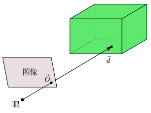
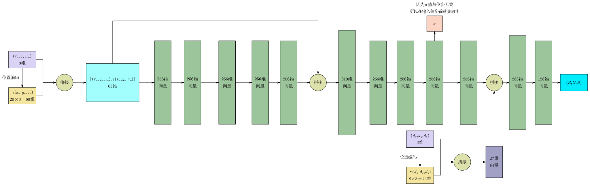

# 什么是 NeRF

NeRF 就是使用神经网络来隐式存储 3D 信息。

- 显式 3D 信息：有明确的 $(x,y,z)$ 值，如 mesh，voxel，点云。
- 隐式 3D 信息：无明确的 $(x,y,z)$ 值，只能输出指定角度的 2D 图片。

训练时使用给定静止场景下的若干张图片，所以模型不具备泛化能力，一个模型只能存储一种 3D 信息。

# NeRF 的输入输出

模型输入是 5D 向量：$(x_w,y_w,z_w,\theta,\phi)$ ，$(\theta, \phi)$ 为极坐标系下的仰角和方位角。

模型输出是 4D 向量：$(\sigma,R,G,B)$ ，$\sigma$ 为密度。

模型结构是普通的 MLP。

## 体渲染

渲染技术的分支，目的是解决云/烟/果冻等非刚性物体的渲染建模。

将物质抽象成一团飘忽不定的粒子群，光线在穿过时，是光子和粒子发生碰撞的过程，这个过程可分为：

- 吸收：光子被粒子吸收。
- 放射：粒子本身发光。
- 外射光：原本正对着你眼睛传播的光，撞到颗粒后被弹射到了其他方向，导致看到的这束光变暗了。
- 内射光：原本没有朝向你眼睛传播的光，撞到视线路径上的颗粒后，刚好被弹射到了眼睛里。

NeRF假设物体是一团自发光的粒子，粒子有密度和颜色，外射光和内射光抵消，多个粒子被渲染成指定角度的图片。

模型的输入就是：将物体进行稀疏表示的单个粒子的位姿。

模型的输出就是：该粒子的密度和颜色。

## 粒子的采集

空间中的某一个发光粒子，通过摄像机模型成为图像上的像素坐标，粒子的颜色就是像素颜色，从世界坐标系到像素平面坐标系的过程：

$$
\begin{bmatrix}
z \cdot u \\
z \cdot v \\
z
\end{bmatrix}= 
\underbrace{
\begin{bmatrix}
k_{x'} \cdot f & -k_{x'} \cdot f \cdot \cot\theta & u_0 & 0 \\
0 & \frac{k_{y'} \cdot f}{\sin\theta} & v_0 & 0 \\
0 & 0 & 1 & 0
\end{bmatrix}
}_{\text{相机内参矩阵}}
\cdot 
\underbrace{
\begin{bmatrix}
R_{11} & R_{12} & R_{13} & t_1 \\
R_{21} & R_{22} & R_{23} & t_2 \\
R_{31} & R_{32} & R_{33} & t_3 \\
0 & 0 & 0 & 1
\end{bmatrix}
}_{\text{相机外参矩阵}}
\cdot
\begin{bmatrix}
x_w \\
y_w \\
z_w \\
1
\end{bmatrix}
$$

对于图像上的某一个像素，可以看作是沿着某一条射线上无数个粒子通过摄像机后的叠加。

这条射线在世界坐标系下的表示就是：$r(t)=\vec{O}+t\vec{d}$ ，$\vec{O}$ 为射线原点，$\vec{d}$ 为射线方向，$t$ 为距离。理论上 $t\in[0,+\infty)$ 。对于整张图像，如果图像尺寸为 $H\times W$ ，那这张图象就有 $H\times W$ 条射线。

射线可以通过图像和相机位姿计算得到，然后从射线上采样粒子，就得到了每个粒子在世界坐标系下的坐标。

例如训练时，一张图片取 1024 个像素，即 1024 条射线，每条射线上采样 64 个点，所以一张图像共得到 $1024 \times 64$ 个粒子。

在 NeRF 的原始论文中，作者为了在数学和物理概念上严谨，将输入定义为 5D 坐标：世界坐标系 $(x_w, y_w, z_w)$ 加上极坐标系下的仰角和方位角 $(\theta, \phi)$ 。但在所有的实际代码实现(包括原作者的官方代码)中，输入都被改成了 6D 坐标：$(x_w, y_w, z_w)$ 加上射线的单位方向向量 $\vec{d} = (d_x, d_y, d_z)$ ，而且同一射线上的粒子共享一个单位方向向量 $\vec{d}$ 。

# Loss 怎么计算

loss 的计算采用自监督的方式，loss 的计算方式为：

$$
\mathcal{L} = \sum_{r \in \mathcal{R}} \left\Vert{} \hat{C}(r) - C(r) \right\Vert{}_2^2
$$

- $C(r)$：真实颜色，也就是对应射线 $r$ 在真实训练照片上的那个像素点的 RGB 颜色值。

- $\hat{C}(r)$：预测颜色，即神经网络针对这条射线，通过上一步“体渲染”机制把沿途所有粒子的颜色和密度积分(累加)后，最终算出来的那一个 RGB 颜色值。

- $\left\Vert{} \cdot \right\Vert{}_2^2$：L2 范数的平方。

假设射线 $r$ 上有 $N$ 个采样点，第 $i$ 个点到下一个点 $i+1$ 之间的距离是 $\delta_i$ ，$\hat{C}(r)$ 的计算公式如下：

$$
\hat{C}(r) = \sum_{i=1}^{N} T_i \cdot \alpha_i \cdot c_i
$$

- $c_i$ ：网络预测出来的第 $i$ 个采样点的 RGB 颜色。
- $\alpha_i$：粒子的不透明度，$\alpha_i = 1 - e^{-\sigma_i \cdot \delta_i}$ 。物理直觉上，如果这个地方的密度 $\sigma_i$ 很大或者这段距离 $\delta_i$ 很长，那么指数部分趋于 0，$\alpha_i$ 就趋于 1(完全不透明，像一堵实心墙)。如果密度为 0，$\alpha_i$ 就是 0(完全透明，纯空气)。
- $T_i = e^{-\sum_{j=1}^{i-1} \sigma_j \cdot \delta_j} = \prod_{j=1}^{i-1} (1 - \alpha_j)$ 。物理直觉上，如果想看清这条射线上第 $i$ 个粒子的颜色。如果前面第 $j$ 个粒子是一堵不透明的实心墙($\alpha_j = 1$)，那么 $1 - \alpha_j = 0$。连乘下来，到达第 $i$ 个粒子的透射率 $T_i$ 就会直接变成 0。

# NeRF 的实际网络架构

因为低维度的输入 $(x_w,y_w,z_w)$ 和 $(d_x,d_y,d_z)$ 很难让 MLP 学习到场景中的高频细节，NeRF 使用正弦和余弦函数，将连续的低维坐标映射到高维空间：

$$
\gamma(p) = (\sin2^0 \pi p, \cos2^0 \pi p, \cdots, \sin2^{L-1} \pi p, \cos2^{L-1} \pi p)
$$

- 对于 3D 坐标 $(x_w,y_w,z_w)$，通常取 $L=10$，将其扩展为 60 维向量。
- 对于视角方向 $\vec{d}$，通常取 $L=4$，将其扩展为 24 维向量。

## 分层采样

同样的网络架构被使用了两次。

- 第一次：在一条射线上，均匀采样，通常采样 $N_c = 64$ 个点，然后输入网络。主要是为了探明一条射线上哪里是空气(密度 $\sigma \approx 0$)，哪里可能有固体(密度 $\sigma$ 很大)。$N_c$ 中第 $i$ 个采样点的权重 $w_i = T_i \cdot \alpha_i$ ，然后对这些权重做 Softmax，即$\hat{w}_i = \displaystyle\frac{w_i}{\sum_{j=1}^{N_c} w_j}$ ，这 $N_c$ 个分段的 $\hat{w}_i$ 就可以看成射线的分段常数概率密度函数。

- 第二次：通过逆变换采样，在这个概率密度上采样128个点，并带上之前的64个点，共192个点输入进网络中。
