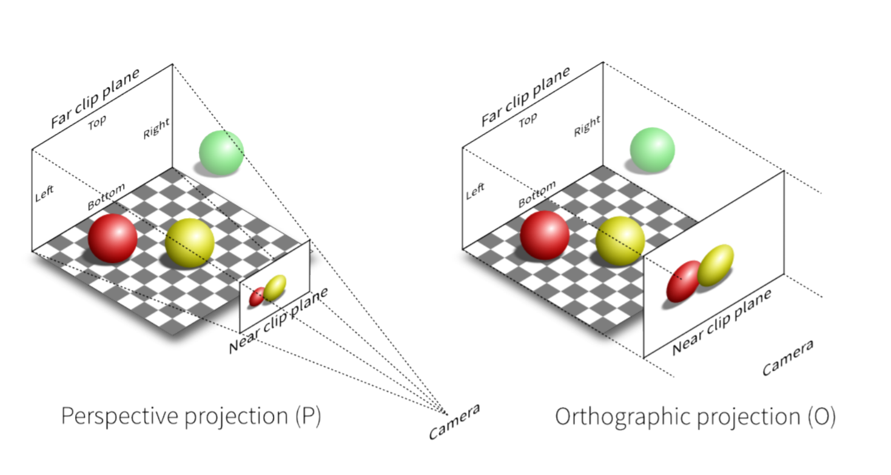
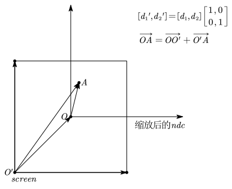
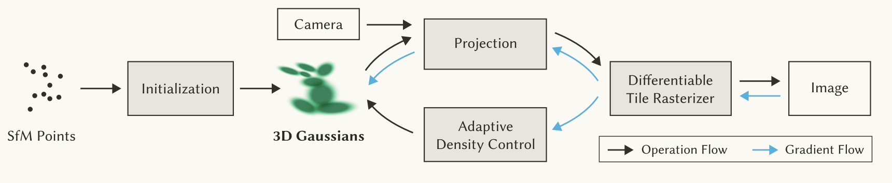

3DGS 是基于 Splatting 和 机器学习的三维重建方法：

- 无深度学习
- 简单的机器学习
- 大量的 CG 知识
- 复杂的线性代数
- 高性能 GPU 编程

# Splatting

Splatting 是一种体渲染的方法(从 3D 物体到 2D 平面)。

[NeRF](01-Neural Radiance Fields(神经辐射场,NeRF).md) 使用的体渲染方法叫做 Ray-Casting，是被动的，计算每个像素点受到发光粒子的影响来生成图像(主角是像素)。

Splatting是主动的，计算出每个发光粒子如何影响像素点(主角是粒子)。

## 3D 高斯为什么是椭球

一般形式的高斯概率密度函数是：

$$
G(\boldsymbol{x};\boldsymbol{\mu},\boldsymbol{\Sigma}) = \frac{1}{\sqrt{(2\pi)^{n} |\boldsymbol{\Sigma}|}} \exp\left(-\frac{1}{2}(\boldsymbol{x} - \boldsymbol{\mu})^\top \boldsymbol{\Sigma}^{-1} (\boldsymbol{x} - \boldsymbol{\mu})\right)
$$
如果让 $(\boldsymbol{x} - \boldsymbol{\mu})^\top \boldsymbol{\Sigma}^{-1} (\boldsymbol{x} - \boldsymbol{\mu}) = C$ ，那么在 3 维情况下展开就有：

$$
\begin{aligned}
C &= (x - \mu)^T \Sigma^{-1} (x - \mu) \\
&= \frac{(x - \mu_1)^2}{\sigma_1^2} + \frac{(y - \mu_2)^2}{\sigma_2^2} + \frac{(z - \mu_3)^2}{\sigma_3^2} \\
&\quad - \frac{2\sigma_{xy}(x - \mu_1)(y - \mu_2)}{\sigma_1\sigma_2} - \frac{2\sigma_{xz}(x - \mu_1)(z - \mu_3)}{\sigma_1\sigma_3} - \frac{2\sigma_{yz}(y - \mu_2)(z - \mu_3)}{\sigma_2\sigma_3}
\end{aligned}
$$

最终一定就能转化成：

$$
Ax^2 + By^2 + Cz^2 + 2Dxy + 2Exz + 2Fyz = 1
$$

也就是说等值面是一个椭球面，取不同的常数值就有不同的椭球面一层一层包裹起来，但是所有椭球面的中心都一样并且它们的倾斜角度和旋转姿态都一样。

并且协方差矩阵 $\boldsymbol{\Sigma}$ 可以分解为缩放和旋转两个独立的矩阵：

$$
\Sigma = R S S^\top R^\top\\\\
S = \begin{bmatrix} s_x & 0 & 0 \\ 0 & s_y & 0 \\ 0 & 0 & s_z \end{bmatrix}\\\\
R = \begin{bmatrix} r_{11} & r_{12} & r_{13} \\ r_{21} & r_{22} & r_{23} \\ r_{31} & r_{32} & r_{33} \end{bmatrix}
$$

## 从 3D 到像素

### 观测变换(World $\to$ Cammera)

观测变换就是从世界坐标系转换到相机坐标系：

$$
\begin{bmatrix}
x_c \\
y_c \\
z_c \\
1
\end{bmatrix}
=
\begin{bmatrix}
R & T \\
0^T & 1
\end{bmatrix}_{4 \times 4}
\begin{bmatrix}
x_w \\
y_w \\
z_w \\
1
\end{bmatrix}
$$

### 投影变换(Cammera $\to$ NDC)

真实世界的相机或者人眼都有一个视场范围(视锥体 Frustum)。投影变换就是把这个视锥体里的东西即相机视野内的三维空间，全部挤压到一个 $(x, y,z)$ 都在 $[-1, 1]$ 范围内的标准立方体中，也就是从相机坐标转化为 NDC 坐标(Normalized Device Coordinates，标准化设备坐标)，通常分为两种：

- 正交投影 (Orthographic Projection)：不具有“近大远小”的透视效果，通常用于工程制图或 2D 游戏。
- 透视投影 (Perspective Projection)：符合人眼视觉规律，越远的物体看起来越小。

假设相机看向 $-z$ 方向，视野的边界由六个参数定义：左 $l$ (left)、右 $r$ (right)、下 $b$ (bottom)、上 $t$ (top)、近平面 $n$ (near)、远平面 $f$ (far)。由于看向 $-z$，通常 $n > f$ ($n$ 和 $f$ 都为负)。

1. 正交投影视锥体本身就是一个长方体，所以只需要先平移再缩放，如果原来的视锥体空间范围是：$[l, r] \times [b, t] \times [f, n]$ ：

- 把长方体的中心点移到坐标系原点 $(0,0,0)$。 中心点坐标是 $(\frac{r+l}{2}, \frac{t+b}{2}, \frac{n+f}{2})$，所以要减去这个坐标：

$$
\begin{bmatrix}
x^\prime_c \\
y^\prime_c \\
z^\prime_c \\
1
\end{bmatrix}
=\begin{bmatrix} 1 & 0 & 0 & -\frac{r+l}{2} \\ 0 & 1 & 0 & -\frac{t+b}{2} \\ 0 & 0 & 1 & -\frac{n+f}{2} \\ 0 & 0 & 0 & 1 \end{bmatrix}
\begin{bmatrix}
x_c \\
y_c \\
z_c \\
1
\end{bmatrix}
$$

- 把长方体的长宽高缩放到 2(因为 $[-1, 1]$ 的长度是 2)。 原来的长宽高分别是 $(r-l), (t-b), (n-f)$，所以缩放后：

$$
\begin{bmatrix}
x^{\prime\prime}_c \\
y^{\prime\prime}_c \\
z^{\prime\prime}_c \\
1
\end{bmatrix}
=\begin{bmatrix} \frac{2}{r-l} & 0 & 0 & 0 \\ 0 & \frac{2}{t-b} & 0 & 0 \\ 0 & 0 & \frac{2}{n-f} & 0 \\ 0 & 0 & 0 & 1 \end{bmatrix}
\begin{bmatrix}
x^\prime_c \\
y^\prime_c \\
z^\prime_c \\
1
\end{bmatrix}
$$

所以正交投影的投影矩阵就是：

$$
M_{ortho} =
\begin{bmatrix} \frac{2}{r-l} & 0 & 0 & 0 \\ 0 & \frac{2}{t-b} & 0 & 0 \\ 0 & 0 & \frac{2}{n-f} & 0 \\ 0 & 0 & 0 & 1 \end{bmatrix}
\begin{bmatrix} 1 & 0 & 0 & -\frac{r+l}{2} \\ 0 & 1 & 0 & -\frac{t+b}{2} \\ 0 & 0 & 1 & -\frac{n+f}{2} \\ 0 & 0 & 0 & 1 \end{bmatrix}
=
\begin{bmatrix} \frac{2}{r-l} & 0 & 0 & -\frac{r+l}{r-l} \\ 0 & \frac{2}{t-b} & 0 & -\frac{t+b}{t-b} \\ 0 & 0 & \frac{2}{n-f} & -\frac{n+f}{n-f} \\ 0 & 0 & 0 & 1 \end{bmatrix}
$$

- 实际上相机坐标乘上正交投影矩阵后，得到的坐标就已经是 NDC 坐标了：

$$
\begin{bmatrix} x_{ndc} \\ y_{ndc} \\ z_{ndc}\\1 \end{bmatrix}=
\begin{bmatrix} \frac{2}{r-l} & 0 & 0 & -\frac{r+l}{r-l} \\ 0 & \frac{2}{t-b} & 0 & -\frac{t+b}{t-b} \\ 0 & 0 & \frac{2}{n-f} & -\frac{n+f}{n-f} \\ 0 & 0 & 0 & 1 \end{bmatrix}
\begin{bmatrix}
x_c \\
y_c \\
z_c \\
1
\end{bmatrix}
$$

2. 透视投影要先将平截头体的远平面缩小，将其挤压成一个长方体，然后再进行正交投影映射到标准立方体中：

- 挤压矩阵 $M_{persp \to ortho}$ ：

$$
M_{persp \to ortho} = \begin{bmatrix} n & 0 & 0 & 0 \\ 0 & n & 0 & 0 \\ 0 & 0 & n+f & -nf \\ 0 & 0 & 1 & 0 \end{bmatrix}
$$

- 挤压成长方体后，就可以进行正交投影：

$$
M_{persp} = M_{ortho} \cdot M_{persp \to ortho}= \begin{bmatrix} \frac{2n}{r-l} & 0 & -\frac{r+l}{r-l} & 0 \\ 0 & \frac{2n}{t-b} & -\frac{t+b}{t-b} & 0 \\ 0 & 0 & \frac{n+f}{n-f} & -\frac{2nf}{n-f} \\ 0 & 0 & 1 & 0 \end{bmatrix}
$$

- 相机坐标乘上透视投影矩阵后，得到的是裁剪坐标：

$$
\begin{bmatrix}
x_{clip}\\y_{clip}\\z_{clip}\\w_{clip}
\end{bmatrix}
=
\begin{bmatrix} \frac{2n}{r-l} & 0 & -\frac{r+l}{r-l} & 0 \\ 0 & \frac{2n}{t-b} & -\frac{t+b}{t-b} & 0 \\ 0 & 0 & \frac{n+f}{n-f} & -\frac{2nf}{n-f} \\ 0 & 0 & 1 & 0 \end{bmatrix}
\begin{bmatrix}
x_c \\
y_c \\
z_c \\
1
\end{bmatrix}
$$

- 裁剪坐标进行透视除法后得到了标准化设备坐标，视锥体内部的三维几何体都被压缩进了一个边长为 2 的标准正方体中：

$$
\begin{bmatrix} x_{ndc} \\ y_{ndc} \\ z_{ndc}\\1 \end{bmatrix} = \begin{bmatrix} x_{clip} / w_{clip} \\ y_{clip} / w_{clip} \\ z_{clip} / w_{clip}\\ w_{clip} / w_{clip} \end{bmatrix}
$$

### 视口变换(NDC $\to$ Screen)

得到 NDC 坐标后，为了让内容正确显示在屏幕上，需要转化成屏幕坐标。

假设屏幕宽度为 $W$，高度为 $H$，左下角坐标为 $(0, 0)$。我们只需要对 $x$ 和 $y$ 进行处理：

- NDC 的宽度和高度都是 2，而屏幕是 $W$ 和 $H$，所以要将 $x$ 放大 $\displaystyle\frac{W}{2}$ 倍，$y$ 放大 $\displaystyle\frac{H}{2}$ 倍。
- 缩放后，原本 NDC 坐标的原点对应屏幕的中心点 $(\frac{W}{2}, \frac{H}{2})$，为了得到屏幕坐标，需要加上 $(\frac{W}{2}, \frac{H}{2})$ 。

最后得到的视口变换矩阵就是：

$$
M_{viewport} = \begin{bmatrix} \frac{W}{2} & 0 & 0 & \frac{W}{2} \\ 0 & \frac{H}{2} & 0 & \frac{H}{2} \\ 0 & 0 & 1 & 0 \\ 0 & 0 & 0 & 1 \end{bmatrix}
$$

把 NDC 坐标乘上这个矩阵，就得到的了屏幕坐标(Screen Coordinates)：

$$
\begin{bmatrix} x_{screen} \\ y_{screen} \\ z_{screen}\\1 \end{bmatrix}=\begin{bmatrix} \frac{W}{2} & 0 & 0 & \frac{W}{2} \\ 0 & \frac{H}{2} & 0 & \frac{H}{2} \\ 0 & 0 & 1 & 0 \\ 0 & 0 & 0 & 1 \end{bmatrix}\begin{bmatrix} x_{ndc} \\ y_{ndc} \\ z_{ndc}\\1 \end{bmatrix}
$$

### 光栅化

通过观测变换，投影变换，视口变换后，再经过光栅化找准被盖住的像素格子并涂上颜色，最终的图形就实打实地变成画面画到物理屏幕上了。

# 3D 高斯的各种变换

## 观测变换

将 3D 高斯从世界坐标系转换到相机坐标系，确立高斯椭球相对于当前镜头的位置和朝向。

设 3D 椭球的中心为 $\boldsymbol{\mu}$ ，协方差为 $\Sigma$ 。相机外参为一个 $3 \times 3$ 的旋转矩阵 $R$ 和一个 3D 平移向量 $\boldsymbol{T}$ 。

那么在相机坐标系中，3D 高斯椭球的中心位置和协方差就变成了：

$$
\boldsymbol{\mu}_{c} = R\boldsymbol{\mu} + \boldsymbol{T}\\
\Sigma_{c} = R \Sigma R^\top
$$

## 投影变换

椭球中心点 $\boldsymbol{\mu}_c$ 直接变换到 NDC 坐标：

$$
\begin{bmatrix}
x_{clip}\\y_{clip}\\z_{clip}\\w_{clip}
\end{bmatrix}
=
\begin{bmatrix} \frac{2n}{r-l} & 0 & -\frac{r+l}{r-l} & 0 \\ 0 & \frac{2n}{t-b} & -\frac{t+b}{t-b} & 0 \\ 0 & 0 & \frac{n+f}{n-f} & -\frac{2nf}{n-f} \\ 0 & 0 & 1 & 0 \end{bmatrix}
\begin{bmatrix}
x_c \\
y_c \\
z_c \\
1
\end{bmatrix}\\\\
\begin{bmatrix} x_{ndc} \\ y_{ndc} \\ z_{ndc}\\1 \end{bmatrix} = \begin{bmatrix} x_{clip} / w_{clip} \\ y_{clip} / w_{clip} \\ z_{clip} / w_{clip}\\ w_{clip} / w_{clip} \end{bmatrix}
$$

高斯椭球的的形状(协方差)如果也跟着做非线性的投影变换会导致高斯椭球变形。所以用雅可比矩阵 $J$ 做仿射近似，在中心点 $\boldsymbol{\mu}_{c} = [x_c, y_c, z_c]^\top$ 处对映射函数求偏导：

$$
\begin{bmatrix} nx_c \\ ny_c \\ (n+f)z_c - nf \\ z_c \end{bmatrix}=\begin{bmatrix} n & 0 & 0 & 0 \\ 0 & n & 0 & 0 \\ 0 & 0 & n+f & -nf \\ 0 & 0 & 1 & 0 \end{bmatrix} \begin{bmatrix} x_c \\ y_c \\ z_c \\ 1 \end{bmatrix}\\\\
\begin{bmatrix} nx_c \\ ny_c \\ (n+f)z_c - nf \\ z_c \end{bmatrix} \to \begin{bmatrix} \frac{nx_c}{z_c} \\ \frac{ny_c}{z_c} \\ (n+f) - \frac{nf}{z_c} \\ 1 \end{bmatrix}\\\\
\begin{bmatrix} f_1(x_c) \\ f_2(y_c) \\ f_3(z_c) \end{bmatrix}=\begin{bmatrix} \frac{nx_c}{z_c} \\ \frac{ny_c}{z_c} \\ (n+f) - \frac{nf}{z_c} \end{bmatrix}\\\\
J = \frac{\partial(f_1,f_2,f_3)}{\partial(x_c,y_c,z_c)} = \begin{bmatrix} \frac{n}{z_c} & 0 & -\frac{nx_c}{z_c^2} \\ 0 & \frac{n}{z_c} & -\frac{ny_c}{z_c^2} \\ 0 & 0 & \frac{nf}{z_c^2} \end{bmatrix}\\\\
\Sigma_{ndc} = J \Sigma_{c} J^\top = JR \Sigma R^\top J^\top
$$

## 视口变换

椭球中心点在屏幕上的坐标 $\boldsymbol{\mu}_{2D}$ 就是 $\begin{bmatrix}\frac{W}{2}(x_{ndc} + 1)\\\frac{H}{2}(y_{ndc} + 1)\end{bmatrix}$ 。

协方差矩阵 $\Sigma_{ndc}$ 的视口变换只需根据屏幕的宽 $W$ 和高 $H$ 对其进行缩放，对角缩放矩阵 $S_{viewport}$ 就是 $M_{viewport}$ 左上角的那个 $3\times 2$ 矩阵：

$$
S_{viewport} = \begin{bmatrix} \frac{W}{2} & 0 & 0 \\ 0 & \frac{H}{2} & 0 \\ 0 & 0 & 1 \end{bmatrix}\\\\
\Sigma_{3Dscreen} = S_{viewport} \Sigma_{ndc} S_{viewport}^\top
$$

此时得到的 $\Sigma_{3Dscreen}$，表示的是在实际像素坐标系下的 3D 高斯形状，丢弃 $\Sigma_{screen\_3d}$ 的第三行和第三列，提取左上角的 $2 \times 2$ 子矩阵：

$$
\Sigma_{2D} = \begin{bmatrix} \sigma_{00} & \sigma_{01} \\ \sigma_{10} & \sigma_{11} \end{bmatrix}
$$

这个 $\Sigma_{2D}$ 就是最终交给光栅化器去画 2D 椭圆斑点(Splat)的协方差。

>注：由于工程优化，3DGS 源码直接把横向和竖向焦距 $f_x, f_y$ 塞进了雅可比矩阵，并把雅可比矩阵第三行强行写 0，其实就是把上面视口缩放和取子矩阵的过程，跟投影变换合并成一步提前算完了。

# 球谐函数

球谐函数用于计算高斯椭球的颜色。

设相机看向某个 3D 高斯点的观察方向向量为单位向量 $\boldsymbol{d}$。高斯点最终呈现的颜色 $C(\boldsymbol{d})$，由一组固定的基函数 $Y_l^m(\boldsymbol{d})$ 与权重系数 $c_l^m$ 线性叠加构成：

$$
C(\boldsymbol{d}) = \sum_{l=0}^{l_{max}} \sum_{m=-l}^{l} c_l^m Y_l^m(\boldsymbol{d})
$$

- 基函数 $Y_l^m(\boldsymbol{d})$：定义在球面上的正交基函数序列(可类比为球面上的傅里叶变换基)。
- SH系数 $c_l^m$：每个高斯椭球在训练中学习到的特定参数。对于 RGB 三通道，每个系数是一个 3D 向量。
- 阶数 $l$：3DGS 官方实现最高支持到 3 阶（$l_{max} = 3$），共计 $1 + 3 + 5 + 7 = 16$ 个基函数。因此，每个高斯椭球需存储 48 个浮点数来完整表达颜色。
- 在这里，球谐函数最终输出的是一个三通道的 $[R,G,B]$ 值 

# 3DGS 整体工作流程

整体流程：

## 初始化

首先使用 SFM 的方法处理多视角照片，计算出相机的位姿(内外参)，并在空间中生成稀疏的 3D 点云。

将 SFM 生成的点云中的每一个点，作为 3D 高斯椭球的中心点并赋予初值：

- 颜色：提取该 SFM 点在原照片上的 RGB 颜色，用于初始化 0 阶 SH 系数 $c_0^0$ (代表基础底色)，其余 15 个高阶 SH 系数 $c_1^{-1}, c_1^0, c_1^1,\cdots, c_3^3$ 全部初始化为 0。
- 缩放 $\boldsymbol{s}$：计算该中心点到离它最近的 3 个邻居中心点的平均距离，将这个距离作为初始的三轴等比例缩放值(此时的高斯是一个正圆球)，用于构建 $\Sigma = R S S^\top R^\top$ 中的 $S$ 。
- 旋转 $\boldsymbol{q}$：初始化为单位四元数(无旋转)，用于构建 $\Sigma = R S S^\top R^\top$ 中的 $R$ 。
- 不透明度 $\alpha$：赋予一个较低的初始值(如 0.1)。

## 训练循环

在每一次迭代中，系统会从训练集中随机抽取一张真实拍摄的照片以及它对应的相机视角参数。

利用当前相机的外参，经过上述[3D 高斯的各种变换](#3D 高斯的各种变换) 得到所有高斯椭球在屏幕上的中心坐标 $\boldsymbol{\mu}_{2D}$ 和 2D 协方差矩阵 $\Sigma_{2D}$ ，并按照每个高斯椭球中心点到相机的深度由近及远排序。

然后严格执行以下 4 步：

### 前向传播

算出当前相机看向每个高斯椭球中心的视线向量 $\boldsymbol{d}$，利用球谐函数算出第 $i$ 个高斯椭球在当前视角下的基础颜色 $c_i$ 。

根据每个高斯椭球的 $\Sigma_{2D}$ 计算 $3\sigma$ 包围盒(覆盖 99.7% 的能量区域)。在包围盒内的像素点 $\boldsymbol{x}$，其不透明度按公式：

$$
\alpha' = \alpha \times \exp\left(-\frac{1}{2} (\boldsymbol{x} - \boldsymbol{\mu}_{2D})^\top \Sigma_{2D}^{-1} (\boldsymbol{x} - \boldsymbol{\mu}_{2D})\right)
$$

发生中心向边缘的高斯衰减，包围盒外的直接丢弃。

因为屏幕上的一个像素点，通常会被多个高斯椭球的 $3\sigma$ 包围盒同时覆盖，从离相机最近的第 1 个高斯椭球开始，向远处逐个套用 [NeRF](01-Neural Radiance Fields(神经辐射场,NeRF).md) 中的颜色公式，累加出该像素最终的 RGB 颜色 $\hat{C}$：

$$
\hat{C} = \sum_{i=1}^{N} T_i \alpha_i' c_i\\
T_i = \prod_{j=1}^{i-1} (1 - \alpha_j')\quad , T_1=1
$$

每个像素都被弄出了颜色后，最终就形成了前向传播渲染出来的图片。

### Loss 与反向传播

将前向传播渲染出的图像，与当前抽取的那张真实拍摄照片逐像素做差，计算组合 Loss：

$$
\mathcal{L} = (1 - \lambda) \mathcal{L}_1 + \lambda \mathcal{L}_{D-SSIM}
$$

- $\mathcal{L_1}$ 就是直接把渲染图和真实图同一个位置的像素的 RGB 值逐通道做差取绝对值，然后求和平均。
- $\mathcal{L}_{D-SSIM}$ 是结构相异度损失，作用是让渲染出的画面有一些高频细节。
- $\mathcal{L}_1$ 控制色彩，$\mathcal{L}_{D-SSIM}$ 控制细节。

>在 3DGS 官方源码中，硬编码 $\lambda = 0.2$ ，即 $80\%$ 由 $\mathcal{L}_1$ 负责大面积铺准颜色，$20\%$ 由 $\mathcal{L}_{D-SSIM}$ 负责边缘细节。

$\mathcal{L}$ 反向传播传播后，优化器根据梯度，微调每个高斯椭球的：

- $\boldsymbol{\mu}$ (挪动位置)
- $\boldsymbol{s}, \boldsymbol{q}$ (拉伸、压扁或旋转)
- $\alpha$ (不透明度)
- $c_l^m$ (高阶 SH 系数不再是初始化的 0)

### 自适应密度控制

每隔固定的迭代次数(如每 100 步)，系统会检查每个高斯椭球的位置梯度，进行以下干预：

1. 克隆：若高斯椭球太小且梯度大 $\rightarrow$ 复制一个，顺着梯度挪一点，填补高频细节。
2. 分裂：若高斯椭球太大且梯度大 $\rightarrow$ 强制一分为二。
3. 剔除：若不透明度 $\alpha$ 太低(如 $\alpha < 0.005$ )，或者体积膨胀过大的高斯椭球 $\rightarrow$ 直接物理删除。
4. $\alpha$ 定期重置：例如每隔 3000 步，把所有高斯的 $\alpha$ 强制重置为极小值(如 0.01)，打破互相遮挡形成的局部最优解。

