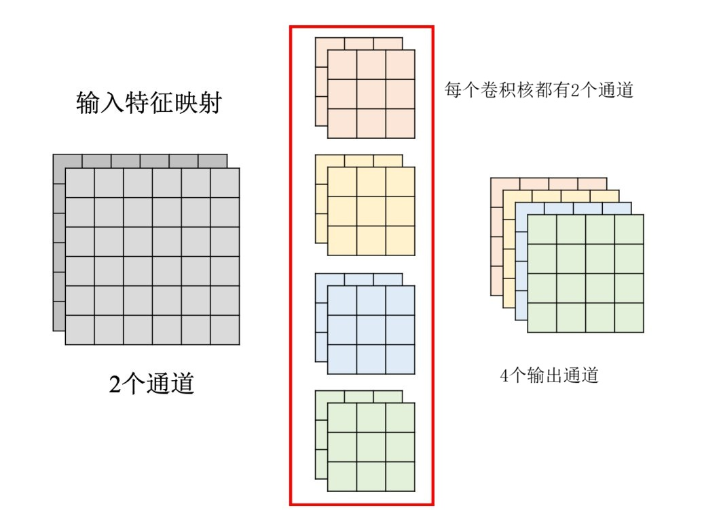

# 卷积神经网络(CNN)

图像 $x$  $\longrightarrow$ 类别概率分布  $\vec{p}$ ，$\vec{p}$ 是一个列向量，里面的数据是对每个类别的概率 $p_i$ ，概率最高的就是模型预测的类别。

通常使用交叉熵损失函数 $\mathcal{L} = -\displaystyle\sum_{i=1}^N y_i \log(p_i)$ ，$y_i$ 为真实标签 $\vec{y}$ 中的数据

如果真实类别 $k$ 对应的 $y_k = 1$，其余 $y_{i \neq k} = 0$。因此，损失函数可以大幅简化为：$\mathcal{L} = -\log(p_k)$ ，这意味着，交叉熵损失只关注网络对正确类别的预测概率。正确类别的概率越接近 1，$-\log(p_k)$ 越接近 0，如果网络对正确类别给出了极低的概率，会产生巨大的惩罚。

CNN并不能识别图像的缩放和旋转，所以在输入数据时，需要做数据增强。

## 卷积层(Convolution Layer)

假设输入模型的图像尺寸都是一样的(就算不一样也可以进行 Resize)。

图像可以分为 RGB 三个通道，即图像就是一个3维张量，将这个3维张量展平成列向量，即可送入全连接网络(此时相当于关注图像全局)。

图像中的有些模式可能只占整张图的很小一部分，所以引入了感受野(Receptive Field)从而只关注图像的某一部分。有些同样的模式会出现在图像的不同部位，所以引入了参数共享(Parameter Sharing)，即不同的神经元使用相同的一组参数。

感受野 $+$ 参数共享 $=$ 卷积层。

## 卷积核

卷积层通过卷积核来完成工作，卷积核本身是一个包含可学习权重的小矩阵。工作机制：

- 卷积核通过在图像上滑动，在覆盖的区域内，卷积核中每个位置的权重与其对应的输入数据元素进行相乘。然后，将所有乘积相加，并通常会加上一个偏置项。
- 计算完一个局部区域后，卷积核会按照预设的步长(Stride)在输入矩阵上平移(从左向右，从上向下)。每次滑动都会重复上述计算，直到遍历完整个输入矩阵。
- 当它滑动到输入矩阵边缘时，如果超出了边界，通常要进行边缘填充(Padding)，最常见的是零填充。

通过这样的操作后得到的图像即为特征图(Feature Map)，一个卷积层可以有很多卷积核，即输出通道数可以有很多。

## 池化(Pooling)

池化的任务是压缩特征并保留关键信息，即下采样。有最大池化(Max Pooling)和平均值池化(Mean Pooling)。工作机制：

- 池化层同样通过一个指定大小感受野在输入张量上滑动，并按照设定的步长进行移动。
- 最大池化：取感受野内元素的最大值。平均值池化：计算感受野内元素的平均值。

## 卷积层结构

设定卷积层主要关注两个参数：输入通道数和输出通道数。

输入通道数 ＝ 单个卷积核的通道数(深度)，比如输入是 3 通道的 RGB 图像，那么每一个卷积核本身也必须有 3 个通道。

输出通道数 = 卷积核的个数，设置了几个卷积核，这一层就会输出几个特征图，每一个特征图都只有一个通道。

最终卷积参数形状为 (输出通道数，输入通道数，长，宽)。

