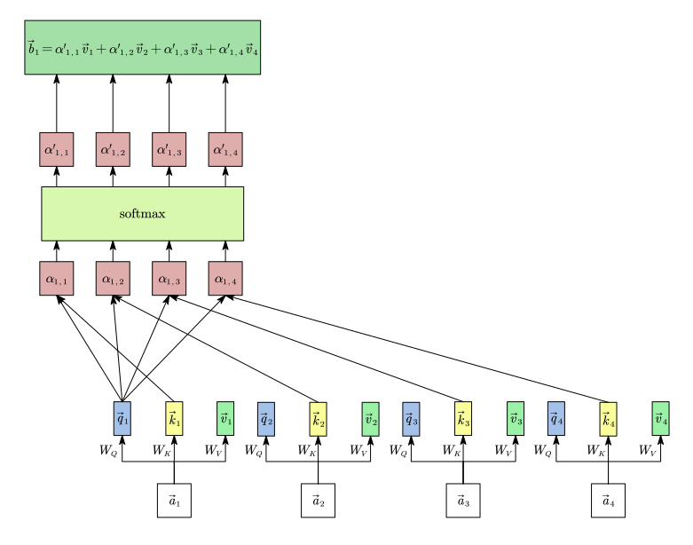

传统的全连接神经网络通常要求输入是一个固定维度的向量。而某些情况下输入是**长度不固定的“向量集合”**(向量集合里向量的数目不固定，集合中每一个单独的向量特征数是固定的)，比如：

- 一句话：可以看作是一组词向量的集合(句子长度不固定)。
- 一张图片：可以切分成多个小块，看作是一组图像块向量的集合(图片大小不固定)。
- 一个图网络：比如社交网络或分子结构，可以看作是一组节点向量的集合(网络节点数不固定)。

对于一个向量集合，我们通常有三种输出需求：

- $N$ 个输入，$N$ 个输出：比如词性标注，每个词对应一个标签。

- $N$ 个输入，$1$ 个输出：比如情感分析，或者将整张图片分类。

- $N$ 个输入，未知个输出：由模型自己决定输出长度，比如翻译。

# Self-Attention

假设我们现在的输入是一个 Vector Set (比如一句话的四个词)，表示为列向量 $\vec{a}_1, \vec{a}_2, \vec{a}_3, \vec{a}_4$。 我们希望经过一个黑盒，输出列向量 $\vec{b}_1, \vec{b}_2, \vec{b}_3, \vec{b}_4$。 这个黑盒的要求是：每一个输出的 $\vec{b}_i$，都必须“看过”所有的 $\vec{a}_i$ 之后再产生。

## 产生 $\vec{q},\vec{k},\vec{v}$ (找人的条件、被找的特征、实际的内容)

每一个输入的向量 $\vec{a}_i$，都会分别乘以三个权重矩阵 $W_Q, W_K, W_V$ (即要学习的参数)，从而得到三个不同的向量：

- $\vec{q}_i$ (query)：去寻找其他相关信息的“查询条件”。
- $\vec{k}_i$ (key)：等待被别人查询的“特征标签”。
- $\vec{v}_i$ (Value)：如果被选中了，实际要传递出去的“核心信息”。

## 计算关联度 (attention Score $\alpha$)

以 $\vec{b}_1$ 的产生过程为例。 

$\vec{a}_1$ 去寻找和自己相关的向量，拿着自己的查询条件 $\vec{q}_1$，去和序列里所有的特征标签 $\vec{k}_i$(包括它自己的 $\vec{k}_1$)做内积计算(Dot-product)：

$$
\alpha_{1,1} = \vec{q}_1 \cdot \vec{k}_1,\\
\alpha_{1,2} = \vec{q}_1 \cdot \vec{k}_2,\\
\alpha_{1,3} = \vec{q}_1 \cdot \vec{k}_3,\\
\alpha_{1,4} = \vec{q}_1 \cdot \vec{k}_4.
$$

算出来的这个 $\alpha$ 称之为 Attention Score(注意力分数)，分数越大，说明两者越相关。

算出的分数大小不一，为了方便处理，把它丢进 Softmax 函数里(也可以是别的，但 Softmax 最常用)，得到归一化后的分数 $\alpha'_{1,i}$ 。最后输出的 $\vec{b}_1$ 定义为：

$$
\vec{b}_1 = \alpha'_{1,1}\vec{v}_1 + \alpha'_{1,2}\vec{v}_2 + \alpha'_{1,3}\vec{v}_3 + \alpha'_{1,4}\vec{v}_4.
$$

$\vec{b}_2,\vec{b}_3,\vec{b}_4$ 的产生过程也和 $\vec{b}_1$ 一样，只不过是把查询条件 $\vec{q}_1$ 分别换成查询条件 $\vec{q}_2,\vec{q}_3,\vec{q}_4$。

## 从矩阵视角看

把所有的 $\vec{a}_1, \vec{a}_2, \vec{a}_3, \vec{a}_4$ 拼成一个矩阵 $I=\left(\vec{a}_1, \vec{a}_2, \vec{a}_3, \vec{a}_4 \right)$。

将 $I$ 乘以 $W_Q, W_K, W_V$，得到三个大矩阵 $Q, K, V$ ：

$$
Q=W_Q \cdot I =\left( W_Q\cdot\vec{a}_1, W_Q\cdot\vec{a}_2, W_Q\cdot\vec{a}_3, W_Q\cdot\vec{a}_4 \right)=\left(\vec{q}_1,\vec{q}_2,\vec{q}_3,\vec{q}_4\right),\\
K=W_K \cdot I =\left( W_K\cdot\vec{a}_1, W_K\cdot\vec{a}_2, W_K\cdot\vec{a}_3, W_K\cdot\vec{a}_4 \right)=\left(\vec{k}_1,\vec{k}_2,\vec{k}_3,\vec{k}_4\right),\\
V=W_V \cdot I =\left( W_V\cdot\vec{a}_1, W_V\cdot\vec{a}_2, W_V\cdot\vec{a}_3, W_V\cdot\vec{a}_4 \right)=\left(\vec{v}_1,\vec{v}_2,\vec{v}_3,\vec{v}_4\right).
$$

把 $Q$ 和 $K^\top$ 乘起来，即可得到向量两两之间的 Attention Score，得到一个注意力矩阵 $A$ ：

$$
\begin{aligned}
A = K^\top Q = 
\begin{pmatrix}
\vec{k}_1^\top\\
\vec{k}_2^\top\\
\vec{k}_3^\top\\
\vec{k}_4^\top
\end{pmatrix} \cdot
\begin{pmatrix}
\vec{q}_1 & \vec{q}_2 & \vec{q}_3 & \vec{q}_4
\end{pmatrix}&=
\begin{pmatrix}
\vec{k}_1^\top \vec{q}_1 & \vec{k}_1^\top \vec{q}_2 & \vec{k}_1^\top \vec{q}_3 & \vec{k}_1^\top \vec{q}_4 \\
\vec{k}_2^\top \vec{q}_1 & \vec{k}_2^\top \vec{q}_2 & \vec{k}_2^\top \vec{q}_3 & \vec{k}_2^\top \vec{q}_4 \\
\vec{k}_3^\top \vec{q}_1 & \vec{k}_3^\top \vec{q}_2 & \vec{k}_3^\top \vec{q}_3 & \vec{k}_3^\top \vec{q}_4 \\
\vec{k}_4^\top \vec{q}_1 & \vec{k}_4^\top \vec{q}_2 & \vec{k}_4^\top \vec{q}_3 & \vec{k}_4^\top \vec{q}_4
\end{pmatrix} \\
&= \begin{pmatrix}
\alpha_{1,1} & \alpha_{2,1} & \alpha_{3,1} & \alpha_{4,1} \\
\alpha_{1,2} & \alpha_{2,2} & \alpha_{3,2} & \alpha_{4,2} \\
\alpha_{1,3} & \alpha_{2,3} & \alpha_{3,3} & \alpha_{4,3} \\
\alpha_{1,4} & \alpha_{2,4} & \alpha_{3,4} & \alpha_{4,4}
\end{pmatrix},
\end{aligned}
$$

对矩阵 $A$ 按列做 Softmax，得到 $\hat{A}$。

最后拿 $V$ 乘以 $\hat{A}$，得到所有输出结果 $O$：

$$
\begin{aligned}
O = V \cdot \hat{A} = 
\begin{pmatrix}
\vec{v}_1 & \vec{v}_2 & \vec{v}_3 & \vec{v}_4
\end{pmatrix} 
\cdot
\begin{pmatrix}
\alpha'_{1,1} & \alpha'_{2,1} & \alpha'_{3,1} & \alpha'_{4,1} \\
\alpha'_{1,2} & \alpha'_{2,2} & \alpha'_{3,2} & \alpha'_{4,2} \\
\alpha'_{1,3} & \alpha'_{2,3} & \alpha'_{3,3} & \alpha'_{4,3} \\
\alpha'_{1,4} & \alpha'_{2,4} & \alpha'_{3,4} & \alpha'_{4,4}
\end{pmatrix}=
\begin{pmatrix}
\vec{b}_1 & \vec{b}_2 & \vec{b}_3 & \vec{b}_4
\end{pmatrix} 
\end{aligned}.
$$

# Multi-head Self-Attention

在单头的自注意力机制中，我们用一个 Query ($\vec{q}$) 去和所有的 Key ($\vec{k}$) 计算相关性。但是，在真实的语言或数据中，两个词之间的“相关性”往往不止一种。

## 运作机制

以 2 个 Head 为例，对于输入序列中的某一个向量 $\vec{a}_i$，具体步骤如下：

首先，和普通的 Self-Attention 一样，向量 $\vec{a}_i$ 乘上对应的权重矩阵，得到初始的 $\vec{q}_i$、$\vec{k}_i$ 和 $\vec{v}_i$。

接下来，我们要把 $\vec{q}_i$ 分给两个不同的 Head 。为了让两个 Head 学到不同的东西，让 $\vec{q}_i$ 分别乘上两个不同的权重矩阵 $W_{Q,1}$ 和 $W_{Q,2}$：

$$
\vec{q}_{i,1}=W_{Q,1} \cdot \vec{q}_i,\\
\vec{q}_{i,2}=W_{Q,2} \cdot \vec{q}_i.
$$

同理，$\vec{k}_i$ 和 $\vec{v}_i$ 也进行同样的操作，得到 $\vec{k}_{i,1}, \vec{k}_{i,2}$ 以及 $\vec{v}_{i,1}, \vec{v}_{i,2}$。

$\vec{q}_{i,1}$ 去和所有的 $\vec{k}_{j,1}$ 做内积并经过 softmax 后得到注意力分数$\alpha'_{i,j,1}$，然后乘上对应的 $\vec{v}_{j,1}$ 并求和，最终得到 Head 1 的输出结果$\vec{b}_{i,1}$。

$\vec{q}_{i,2}$ 去和所有的 $\vec{k}_{j,2}$ 做内积并经过 softmax 后得到注意力分数$\alpha'_{i,j,2}$，然后乘上对应的 $\vec{v}_{j,2}$ 并求和，最终得到 Head 2 的输出结果 $\vec{b}_{i,2}$。

最后，我们需要把两个头的结果合并起来，以便传给下一层网络：

- 拼接 (Concat)： 把 $\vec{b}_{i,1}$ 和 $\vec{b}_{i,2}$ 直接拼成一个更长的向量。

- 映射 (Projection)： 因为拼接后的向量维度变大了，我们再让它乘上一个输出权重矩阵 $W_O$。这不仅能把维度降回我们需要的大小，还能让不同头提取到的信息进行一次融合。

$$
\vec{b}_i = W_O \cdot 
\begin{pmatrix}
\vec{b}_{i,1}\\
\vec{b}_{i,2}
\end{pmatrix}
$$

这个 $\vec{b}_i$ 就是多头注意力机制的最终输出。

计算过程.svg)

# Positional Encoding

Self-Attention 有一个弱点：不管两个词是紧挨着，还是中间隔了十万八千里，它们之间计算 注意力分数的方式是一模一样的。为了解决这个问题，我们需要引入位置编码 (Positional Encoding)。

对于序列里的每一个位置 $i$，我们都去生成一个专属的位置向量 $\vec{e}_i$。然后，直接把原本的词向量 $\vec{a}_i$ 和位置向量 $\vec{e}_i$ 加在一起：

$$
\vec{x}_i = \vec{a}_i + \vec{e}_i
$$

然后再把 $\vec{x}_i$ 丢进 Self-Attention 里去计算 $\vec{q}, \vec{k}, \vec{v}$。
