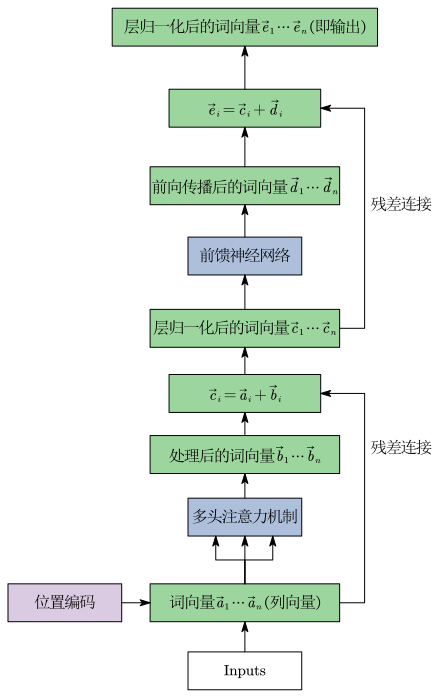
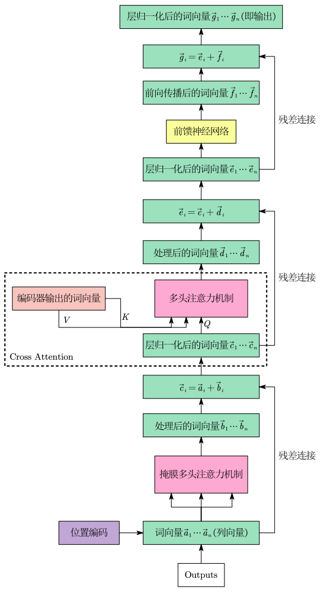
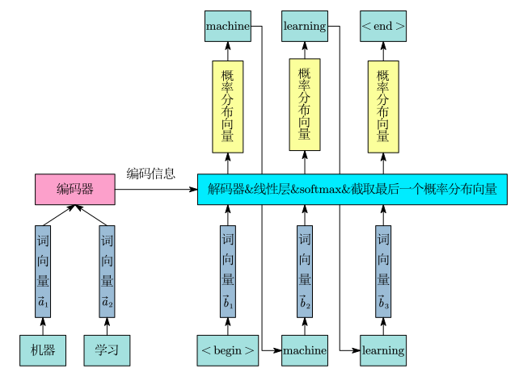
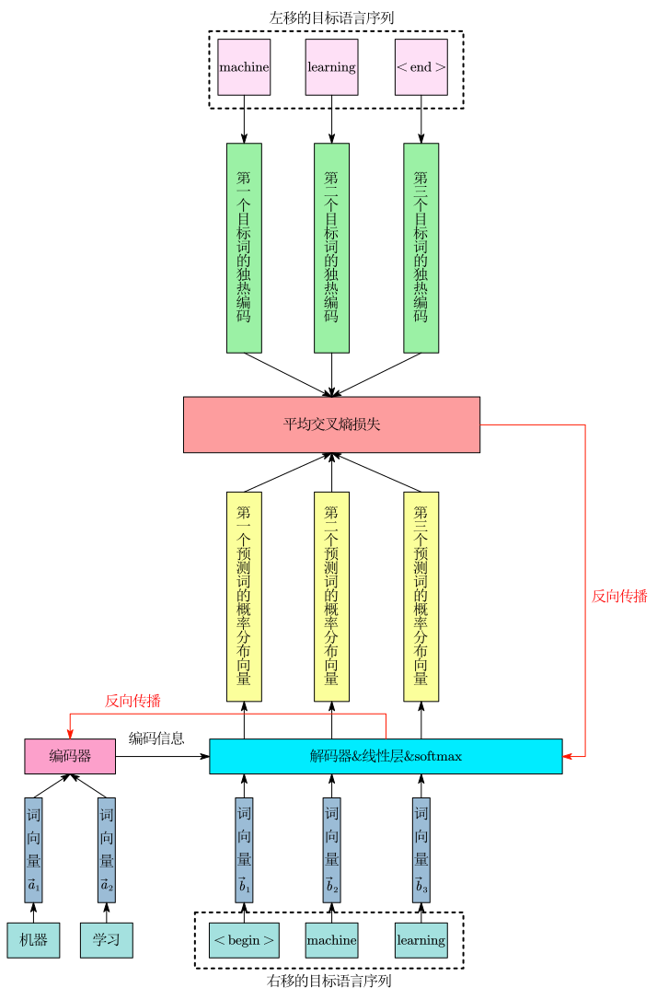

Transfomer 是一个 Sequence-to-Sequence(Seq2Seq) 的模型

Seq2Seq 核心特征是：输入一个序列，输出一个序列，并且输出的长度由机器自己决定，Seq2Seq 的模型能解决许多问题，例如：

- 机器翻译 (Machine Translation)
- 语音辨识 (Speech Recognition)
- 语音翻译 (Speech Translation)

- 聊天机器人 (Chatbot)
- 文本摘要 (Text Summarization)
- 问答系统 (Question Answering, QA)

- 文法剖析 (Syntactic Parsing)
- 多标签分类 (Multi-label Classification)
- 目标检测 (Object Detection)

Seq2Seq模型最基本的结构为：

$$
\text{input sequence} \longrightarrow \text{encoder} \longrightarrow \text{decoder} \longrightarrow \text{output sequence}
$$

#  Encoder 工作机制

输入的文本先经过分词变成一个个 token，token 就是一个词在词表中的索引(一个整数)，每个 token 被映射成一个词向量，也就是嵌入(Embedding)操作(这里以列向量的视角说明)，然后与位置编码相加形成输入。

输入进入编码器后，会先乘上权重矩阵 $W_Q, W_K, W_V$ 变成每个词向量对应的 Query、Key、Value。

接着进行 Multi Head Self-Attention 计算后得到经过处理后的词向量。

随后输出经过残差连接和层归一化，送入前馈神经网络，然后再次经过残差连接和层归一化，这样构成一个 Encoder Layer 。

多个 Encoder Layer 依次堆叠，前一层输出作为后一层输入，最终得到每个 token 经过处理后的词向量。

# Decoder 工作机制

输入端首先接收已经生成的 token 序列，例如训练时输入的是正确答案右移后的序列，推理时输入的是当前已经生成的内容。

每个 token 也先被映射成词向量，然后与位置编码相加形成输入。

随后进入 Masked Multi-Head Self-Attention，Masked Multi-Head Self-Attention 就是使当前位置词向量只能注意到自己以及前面的词向量，不能看到后面的词向量，从而保证自回归生成。

Masked Multi-Head Self-Attention 计算后经过残差连接和层归一化后进入 Encoder-Decoder Attention，也叫 Cross-Attention。

Cross-Attention 就是由上面处理后的词向量产生的 Query 与 encoder 输出的词向量的 Key 和 Value 进行注意力机制的计算。

然后再次经过残差连接和层归一化，之后进入前馈神经网络，再经过一次残差连接和层归一化，这样构成一个 Decoder Layer。

多个 Encoder Layer 依次堆叠，前一层输出作为后一层输入，最终得到每个 token 经过处理后的词向量。

# 推理过程

首先，编码器会将整段源文本划分为 token 序列，然后送入编码器，编码器处理后得到的编码信息送入解码器。

随后，解码器进入自回归的串行生成状态，它从起始符 `<begin>` 开始，每次预测一个新词时，都会用自己目前已经生成的所有内容作为解码器的输入，然后输出经过处理后的词向量。

假设已经预测了 $n$ 个词，则这 $n$ 个词的词向量作为解码器的输入，最终解码器输出相应的 $n$ 个高维隐藏状态向量。这 $n$ 个向量首先会经过一个线性层从而将向量的维数变成词表中词的个数，并计算出 $n$ 组候选词得分向量。随后，这 $n$ 组得分向量会被送入 Softmax 函数，转化为 $n$ 个概率分布向量。此时，由于前 $n-1$ 个分布本质上只是在重复预测已经输入的历史已知词，在推理阶段毫无用处，因此会被模型直接丢弃，模型会截取最后一个(第 $n$ 个)概率分布向量。

最后，模型从这最后一个概率分布中挑出数值最大的那一项，它所对应的 Token 就是模型预测出来的词。

预测出的词加入已知序列中作为解码器新的输入，如此循环往复，直到模型最终输出代表结束的符号 `<End>` ，整个推理过程完成。

# 训练过程

首先，训练数据中的源语言和目标语言序列会先被映射为词向量序列。

随后，源语言词向量序列被一次性编码器中得到处理后词向量，然后送入解码器中。

然后，右移的目标语言序列(头部插入 `<begin>` )的词向量序列作为输入送入解码器中得到处理后的词向量序列，将处理后的词向量送入线性层并经过 softmax 之后得到一组概率分布向量序列。

最后这组概率分布向量序列和左移的目标语言序列(尾部插入 `<end>` )的独热编码序列做交叉熵损失并求平均得到损失函数并进行反向传播。

