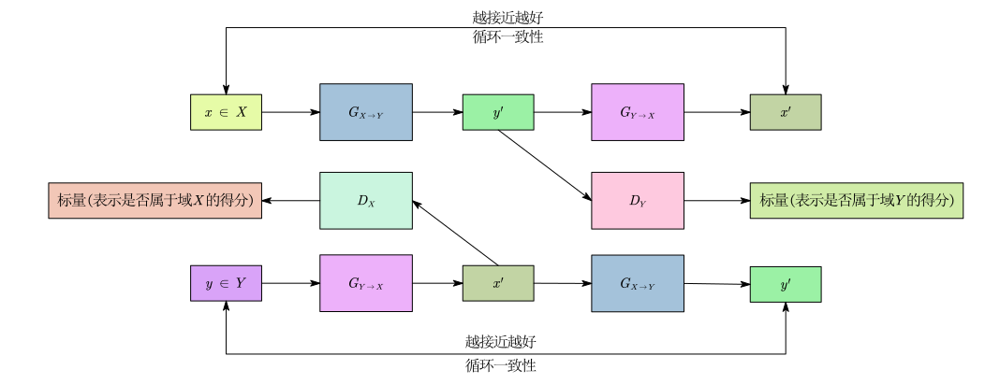

传统的机器学习模型大多只能对输入数据进行分析、分类或预测，不具有创造性。生成式网络能够无中生有地创造出全新的、逼真且多样的内容(如图像、文本、音频和视频)。

GAN(生成对抗网络，Generative Adversarial Network)就是一个经典的生成式网络。

# 基本概念

GAN 的核心思想是“对抗”，它由两个主要的神经网络组成：

- 生成器(Generator, 简称 G)：它的任务是“无中生有”。接收一段随机噪声向量 $\vec{z}$ (通常从正态分布中采样)，然后输出一张图片 $x$ 。它的目标是尽可能生成逼真的图片来骗过判别器。
- 判别器(Discriminator, 简称 D)：它的任务是“分辨真假”。接收一张图片 $x$ (可能是真实的，也可能是 G 生成的)，输出一个标量，代表这张图片是真实的概率。它的目标是准确分辨出真图和假图。

训练过程是交替进行的(以生成图片为例)：

- 固定 G，训练 D： 把真实图片打上标签 1，把 G 生成的图片打上标签 0，目标是让 D 学习如何区分它们。

- 固定 D，训练 G： G 生成图片，丢给已经训练好的 D 去打分，目标是让由 G 生成的图片，D 给出的概率越接近 1 越好。 

在这个互相对抗的过程中，G 生成的图片越来越逼真，D 的鉴别能力也越来越强，最终达到一个平衡。

# GAN 的理论

从数学理论上讲，真实图片服从一个分布 $P_{\text{data}}$，生成器生成的图片服从一个分布 $P_G$。

G 的目标就是让 $P_G$ 无限接近于 $P_{\text{data}}$ ，也就是：
$$
G^* = \arg\min_G \text{Div}(P_G, P_{\text{data}})
$$

$\text{Div}(P_G, P_{\text{data}})$ 是计算 $P_G, P_{\text{data}}$ 的散度。**注意这个散度和数学分析中的散度不是一个概念！**

GAN 里的散度是概率论与信息论中的散度，用来衡量两个概率分布之间“差异程度”的指标，如 KL 散度(连续和离散形式)：

$$
\text{KL}(p,q) = \int_{-\infty}^{+\infty} p(x) \log \left( \frac{p(x)}{q(x)} \right) dx,\\
\text{KL}(P,Q) = \sum_{i=1}^{n} P(x_i) \log \left( \frac{P(x_i)}{Q(x_i)} \right).
$$
数学分析中的散度定义：三维空间中有一可微矢量场 $\vec{F}(x, y, z) = P\cdot\vec{i} + Q\cdot\vec{j} + R\cdot\vec{k}$，则该矢量场在某一点的散度定义为各分量偏导数之和：

$$
\text{div} \mathbf{F} = \nabla \cdot \mathbf{F} = \frac{\partial P}{\partial x} + \frac{\partial Q}{\partial y} + \frac{\partial R}{\partial z}.
$$

由于只有一堆真实照片的样本，根本写不出分布 $P_{\text{data}}$ 的具体公式，所以上面那个散度 $\text{Div}$ 实际上是无法直接计算的。

但是 D 的目标函数可以实际写出：

$$
V(G, D) = \mathbb{E}_{y \sim P_{\text{data}}}[\log D(y)] + \mathbb{E}_{y \sim P_G}[\log\left(1 - D(y)\right)],\\

D^* = \arg\max_D V(G,D).
$$
$\displaystyle\max_D V(G,D)$ 与 $\text{Div}(P_G, P_{\text{data}})$ 有关(JS 散度)，所以就用 $\displaystyle\max_D V(G,D)$ 取代替散度：

$$
G^* = \arg\min_G\left(\max_D V(G,D)\right).
$$
这个式子的意思就是：

- 首先在给定 $G$ 下，找到一个 $D$ 使得 $V(G,D)$ 达到最大。

- 然后在找到的 $D$ 下，寻找一个 $G$ 使得 $\displaystyle\max_D V(G,D)$ 达到最小。

## JS 散度的问题

JS 散度并不直接对比两个分布 $P$ 和 $Q$，而是先取两者的平均分布 $M = \frac{1}{2}(P + Q)$ ，然后计算 $P$ 与 $M$ 的 KL 散度，以及 $Q$ 与 $M$ 的 KL 散度的平均值。

其数学表达式为：

$$
\text{JS}(P,Q) = \frac{1}{2} \text{KL}(P,M) + \frac{1}{2} \text{KL}(Q,M).
$$

图像在高维空间中其实是低维的流形(Manifold)。这意味着 $P_{\text{data}}$ 和 $P_G$ 在高维空间中极大概率是没有重叠的，即在 $P$ 有值的地方，$Q$ 的值全是 $0$ ，在 $Q$ 有值的地方，$P$ 的值全是 $0$。所以无论它们离得多远还是多近，计算出的 JS 散度永远是一个常数 $\log 2$ 。

## WGAN

WGAN 放弃了 JS 散度，引入了 Wasserstein 距离。其核心思想是：假设有一堆土($P_G$)，要把它挖去填满另一个坑($P_{\text{data}}$)，有很多可能的移动方案，每种方案都有各自的平均移动距离，取最小的平均移动距离就是 Wasserstein 距离。

为了算 Wasserstein 距离，判别器 $D$ 必须满足 $1-\text{Lipschitz}$ 连续性，即函数必须要平滑，不能变化太剧烈，Wasserstein 距离就是：
$$
W(P_{\text{data}}, P_G) = \max_{D \in 1-\text{Lipschitz}} \left\{ \mathbb{E}_{y \sim P_{\text{data}}}[D(y)] - \mathbb{E}_{y \sim P_G}[D(y)] \right\}.
$$

生成器 $G$ 就是：

$$
G^* = \arg\min_G W(P_{\text{data}}, P_G).
$$
上述两个式子的意思就是：

- 首先在给定 $G$ 下，找到一个符合$1-\text{Lipschitz}$ 连续性的 $D$ 使得 $\mathbb{E}_{y \sim P_{\text{data}}}[D(y)] - \mathbb{E}_{y \sim P_G}[D(y)]$ 达到最大，这个最大的值就是 $P_{\text{data}}, P_G$的 Wasserstein 距离 $W(P_{\text{data}}, P_G)$ 。

- 然后在找到的 $D$ 下，寻找一个 $G$ 使得 $P_{\text{data}}, P_G$的 Wasserstein 距离 $W(P_{\text{data}}, P_G)$  达到最小。

# 生成器效能评估

GAN 本质上是一个没有明确损失函数可以直观反映生成品质的模型。

评估生成器的效能主要看重两个核心维度：品质与多样性。

## GAN 训练时最容易出现的问题

模式崩溃(Mode Collapse)： 生成器找到了一个“捷径”，发现只要产生某一种特定图片(例如一张完美的人脸)就能一直骗过判别器。结果是它不管收到什么随机噪声输入，都只会产出同一张或极少数几张图片，毫无变化。

模式丢失(Mode Dropping)： 生成器只能产生真实数据分布中的“一部分”。例如训练数据包含了春夏秋冬的风景，但生成器只学会了画夏天的风景，完全产不出其他季节。

## 直观评估

评估生成器的效能，最容易想到的方法就是人工评判，但是人工评判往往主观性较大且成本高昂，为了解决此问题，可以利用预先训练好的图像分类器(通常是 CNN，例如 Inception Network)来进行客观评估的直觉：

- 评估品质：把单张生成的图片丢入分类器，分类器输出的概率分布应该要“非常集中且尖锐”。例如它有 99% 的概率认为这是一只狗，这代表图片特征很清晰，分类器很有把握；如果概率分布很平缓(觉得像狗又像猫)，代表图片四不像或很模糊。
- 评估多样性：把一整批生成的图片丢入分类器，并把每张图片的概率分布平均起来，这个整体的平均分布应该要“越平缓、越均匀越好”。这代表生成器有时产生狗、有时产生猫、有时产生车子，涵盖了各种不同的类别，没有发生 模式崩溃。

## 量化评估

### Inception Score (IS)

IS 计算的是单张图片的条件概率分布与整体图片的边缘概率分布之间的 KL 散度。IS 的数值越大越好，数值大代表单张图片品质好，且整批图片多样性高。

$$
\text{IS} = e^{\mathbb{E}_{x \sim p_G} \left[ \text{KL}(p(c|y),p(c)) \right]}.
$$

 $p(c|y)$ 表示给定单张生成的图片 $y$ ，分类器认为它属于各个类别 $c$ 的概率分布。如果图片品质高，这个分布应该是一个尖锐的高峰。比如 [99% 是狗, 1% 是猫]。

$p(c)$ 就是把所有生成的图片丟进分类器后，得到的概率分布的平均值。如果生成器多样性高，这个分布应该是一条平缓的直线。比如 [33% 是狗, 33% 是猫, 33% 是车]。

因为算出来的 KL 散度通常数值比较小，所以用 $e^x$ 放大。

IS 的一个缺点是，如果生成器把真实数据库里的每一张图片都原封不动地“背”下来并完美复制，IS 会非常高，但生成器其实根本没有创造力。

### Fréchet Inception Distance (FID)

FID 不看分类概率，而是将“真实图片”与“生成图片”都丢进 Inception 网络，但只取网络隐藏层输出的特征向量。接着，假设这两组特征向量在空间中都呈现高斯分布，然后去计算这两个高斯分布之间的 Fréchet 距离。FID 的数值越小越好，距离越小，代表生成出来的图片分布越贴近真实世界的图片分布。

# 条件式生成

基础 GAN 无法准确控制输出的结果，但是我们需要模型根据我们的指令来作画，这就是条件式生成。

条件式生成中，生成器 $G$ 的输入为：随机噪声 $z$ + 条件 $c$ ，判别器需要看输出是否真实且符合给出的条件。

为了让判别器学会这个新任务，我们在训练时丢给它的资料必须包含三种情况，例如：

- 真实的图片 + 正确匹配的文字(打1分)。
- 生成的图片 + 正确的文字(打0分)。
- 真实的图片 + 故意不匹配的错误文字(打0分)。

# Cycle GAN

在图像风格转换(图像到图像翻译)任务中，目标是学习两个视觉域之间的映射关系。

设定真实图像域为 $X$，目标风格图像域为 $Y$。若存在完全对应的成对数据集，可通过监督学习的方式完成模型训练。然而，在实际应用场景中，获取严格对齐的配对数据成本极高甚至无法实现，利用 CycleGAN 可以完成无配对数据下的模型训练。

CycleGAN 在生成器优化阶段引入了“循环一致性”的结构约束，采用完全对称的双向结构：

- 两个生成器：正向 $G_{X \to Y}$ ，逆向 $G_{Y \to X}$ 。
- 两个判别器： $D_X$ (判别域 $X$ 的真伪) 与 $D_Y$ (判别域 $Y$ 的真伪)。

