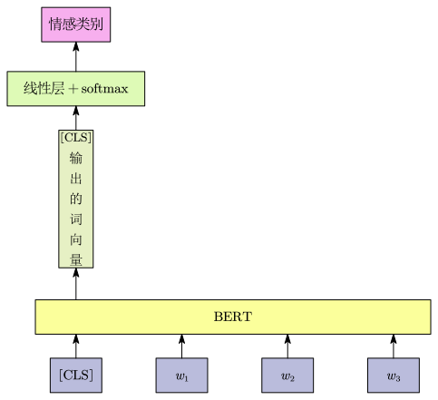
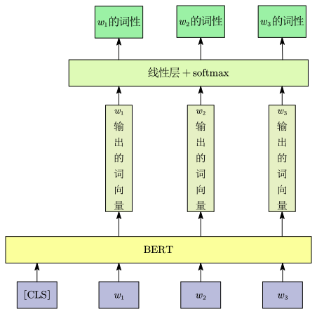
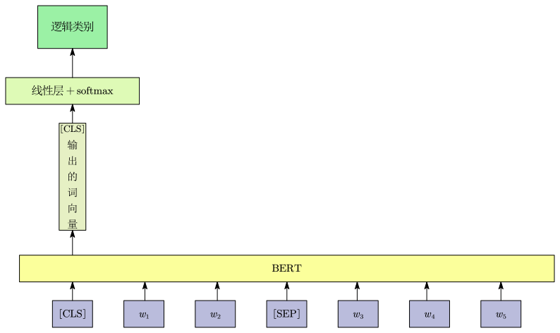
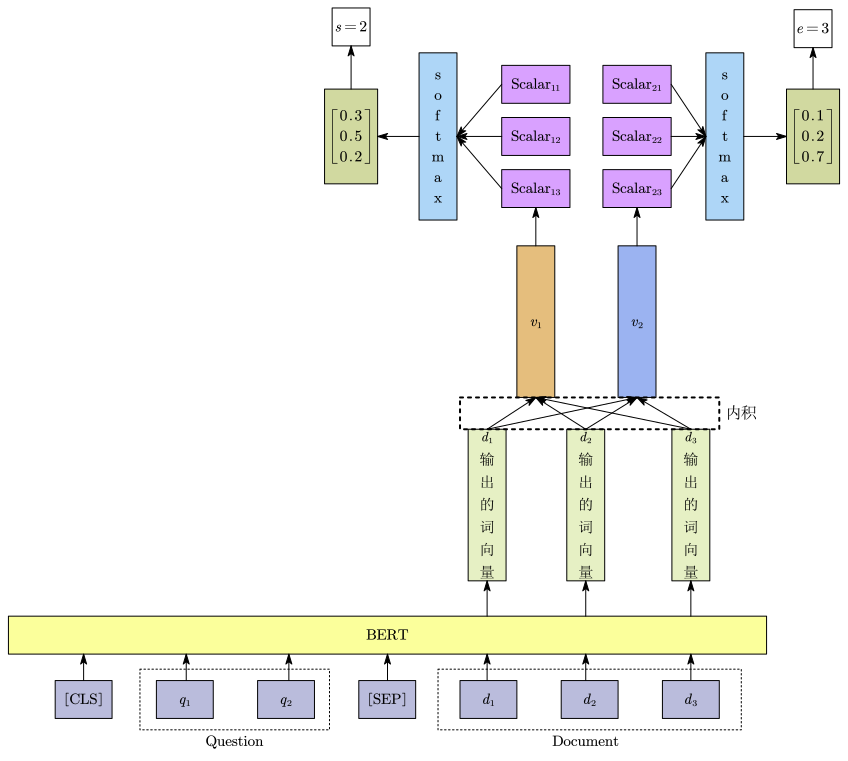

self-supervised learning 属于 unsupervised learning 的一种，其数据本身没有标签。通过把数据分成两部分，一部分喂给模型，另一部分藏起来，让模型去预测被藏起来的部分，从而强行构造出“输入”和“标签”。

为了测试 self-supervised 学习的能力，通常会在一个任务集上测试它的准确性，取其平均值得到总分，这就是GLUE(General Language Understanding Evaluation)指标。

# BERT

BERT 是一种 transformer 的 encoder 。BERT 可以输入一排向量，然后输出另一排向量，输出的向量长度与输入的向量长度相同。 BERT 一般用于自然语言处理，它的输入是一串文本，也可以输入语音、图像等矢量序列。

训练 BERT 有两个任务，分别是 Masking Input 及 Next Sentence Prediction。

## Masking Input

Mask Input 是指随机把一句话里的某些词“盖住”

mask 有两种方法：

- 方法一：用一个叫做 `[MASK]` 的特殊 token  盖住句子中的某个词。

- 方法二：随机把某一个字换成另一个字。

两种方法都可以使用，使用哪种方法也是随机决定的。

训练方法：

- 向 BERT 输入一个句子，先随机决定哪一部分的字将被 mask 。

- 被 mask 后的句子变成一个词向量序列输入给 BERT ，BERT 的输出也是一个词向量序列。

- 找到 mask 部分的相应输出的词向量，将这个向量通过一个线性层(乘上一个矩阵)，并做 softmax 得到一个概率分布，这个概率分布是词表中每一个词的概率。

- 用独热编码的词向量表示被 mask 的字符，计算和输出的概率分布的交叉熵损失，然后反向传播。

## Next Sentence Prediction

在两个句子之间添加一个特殊 token `[SEP]`，代表两句子的分隔，此外还会在句子的开头添加另一个特殊 token `[CLS]` 。

Next Sentence Prediction 的主要目的是让 BERT 学习和理解句子与句子之间的逻辑关系。

在训练时，BERT 会接收“句子对”(句子 A 和句子 B)作为输入，并被要求做一个二分类的“判断题”：句子 B 是不是句子 A 在原文中紧挨着的下一句话，例如：

- 输入 1：`[CLS]` 今天天气真好。`[SEP]` 我们去公园散步吧。`[SEP]` 。那么 BERT 就需要判断并输出 `IsNext`(有逻辑连贯性)。
- 输入 2：`[CLS]` 今天天气真好。`[SEP]` 相对论是爱因斯坦提出的。`[SEP]` 。BERT 的任务：判断并输出 `NotNext`(上下文割裂)。

论文 *[Robustly Optimized BERT Approach](https://arxiv.org/abs/1907.11692)* 指出 Next Sentence Prediction 的方法几乎没有帮助，但还有另一种更有用的方法叫做 Sentence Order Prediction，该方法选择两个句子本来就是连接在一起，但顺序有可能颠倒或没有颠倒两种，BERT 要回答是哪一种。 它被用于名为ALBERT的模型中。

# BERT 的实际用途

BERT 可以用于其他任务，这些任务不一定与上面的两个任务相关， 它可能是完全不同的东西，这些任务称为 downstream tasks 。

在将 BERT 用于其他任务前，需要有预训练(Pre Train)和微调(Fine Tuning)两个阶段：

- 预训练阶段就是做 Masking Input 及 Next Sentence Prediction 两个任务，从而得到一个初始的 BERT 。
- 微调阶段就是让 BERT 去做具体的任务，通常在 BERT 的输出端连接一个能够满足任务需求的网络结构，例如分类器。然后用手里少量的人工标注数据去训练，这时只要稍微调整一下模型参数(微调)，它就能迅速适应新任务并得到不错的结果，并且得到的结果比随机初始化要好。

通过预训练及微调能够让 BERT 完成各式各样的 downstream tasks 。例如：

- 情感分析：给模型一个句子，把 `[CLS]` 放在句子的前面，只关注 `[CLS]` 的输出向量，对它进行线性变换并且做一个softmax，得到一个情感类别。

- 词性标注：给模型一个句子，把 `[CLS]` 放在句子的前面，关注每个字所对应的输出向量，对每一个向量进行线性变换和softmax，得到词性类别。

- 自然语言推理：给出前提 $A$ 和假设 $B$，模型要做的是判断是否有可能从前提中推断出假设。给模型两个句子，把 `[CLS]` 放在句子的前面，以 `[SEP]` 隔开两个句子，只关注 `[CLS]` 的输出向量，对它进行线性变换和 softmax ，得到逻辑类别，通常是这三个逻辑类别：Entailment 、Contradiction 、Neutral 。

$$
\text{Entailmen：}A \implies B, \\
\text{Contradiction：}A \implies \neg B,\\
\text{Neutral：}\text{无法判断}
$$

- 抽取式问答：给模型两个句子，分别为问题和文档，把 `[CLS]` 放在问题的前面，以 `[SEP]` 隔开问题和文档，需要随机初始化两个向量 $\vec{v}_1$ 和 $\vec{v}_2$，这两个向量的长度与 BERT 的输出相同。计算文档中的每一个词的输出向量与 $\vec{v}_1$ 的内积后，做 softmax 取分数最高位置作为 $s$ ； 同样在计算与 $\vec{v}_2$ 的内积后，做 softmax 取分数最高的位置作为 $e$ 。文章中的第 $s$ 到 $e$ 个词汇就是问题的答案。

