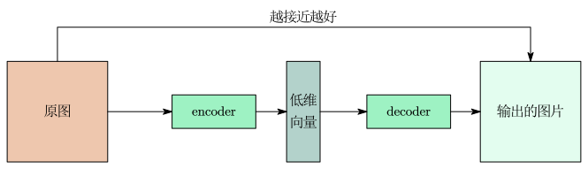
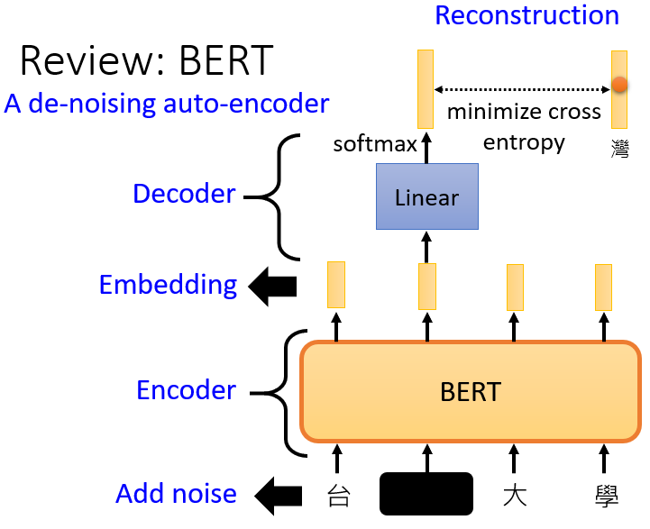
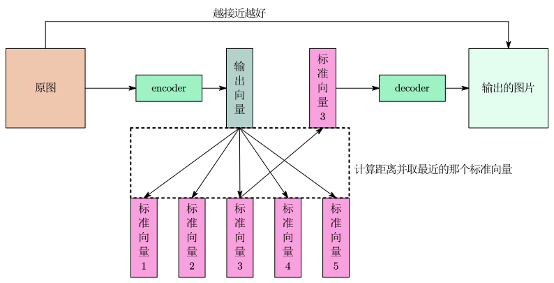

auto-encoder 可以看作是 self-supervised learning 的一种的方法。

使用 auto-encoder 的网络架构：

- encoder 读进一张高维图片，把这张图片变成一个低维向量作为 decoder 的输入。

- decoder 接收 encoder 输出的低维向量，产生一张图片。

训练的目标：encoder 的输入跟 decoder 的输出越接近越好，这和 Cycle  GAN做的事情一模一样。

auto-encoder 的主要想法：图片可以看作是一个很长的向量，但这个向量太长不好处理，所以输入给 encoder 来压缩输出一个较短的向量，也就是降维。

auto-encoder 能成功的原因：一个高维的向量，可能的变化是有限的，所以只需一个低维向量就能够表示高维向量的各种变化情况。 encoder 能够实现这种转换，把复杂的信息用简单的方法表示，实现降维。

## De-noising Auto-encoder

De-noising auto-encoder 是将图片送入 encoder 之前先加一些噪声，然后得到一个 encoder 输出的向量， decoder 接收这个向量并将其还原成原图加入噪声前的结果。BERT 就是一个 De-noising Auto-encoder。

# auto-encoder 的两个重要技术

## 特征解耦(Feature Disentanglement)

在标准的自编码器中，隐藏层里的每一个维度往往同时包含多种信息。比如在处理人脸图像时，隐藏层向量的第 1 个维度可能既影响性别，又影响肤色和微笑程度，这就叫特征耦合。特征解耦的目的是让隐藏层的每一个独立维度(或维度组)只负责数据的一个独立属性，例如：

- 第 1 维：只控制“是否戴眼镜”。

- 第 2 维：只控制“头发长度”。

- 第 3 维：只控制“面部朝向”。

特征解耦为模型带来了极强的可解释性和可操控性，从而可以精准控制生成数据的某一个特定属性。

利用特征解耦可以知道向量中哪些维度代表语音的内容、哪些维度代表语音的声音，只要把其中一人说话的内容的部分取出来，把另一人说话的声音特征的部分取出来，将二者并起来丢到 decoder 里面就可以实现变声，这就是语者转换(voice conversion)

## 离散隐变量表示(Discrete Latent Representation)

离散隐变量表示强制让 encoder 输出的不再是任意的连续值，例如：

- 输出的向量只有 0 和 1，每一个维度它就代表了某种特征是有或者没有。如：第一维0代表男生、1代表女生；第二维0代表有戴眼镜、1代表没戴眼镜 。
- 输出的向量是独热编码的向量，可以在完全没有标注数据的情况下让模型自动学会分类。如：手写数字辨识，输出的向量就是十维的独热编码向量。

### 向量量子化变分自编码器(Vector Quantized Variational Auto-Encoder, VQ-VAE)

Encoder 输出的向量后，用这个向量去和 codebook 里所有的标准向量计算距离，看它离哪个标准向量最近，选出最近的那个标准向量，将这个标准向量输入给 Decoder 。

假设 codebook 里面有 32 个向量，那 decoder 的输入就只有 32 种可能，等于是让 encoder 输出的向量是离散的，没有无穷无尽的可能。codebook 中的标准向量也是从数据当中学习到的。

### Text as Representation

将一段文章输入到 encoder，让 encoder 的输出是一段文字(比如摘要)，再输入到 decoder 还原，但单纯这样效果差。

所以要用上 GAN 的 discriminator，discriminator 看过人写的句子，所以知道人写的句子长什么样，encoder 要想办法产生一段句子，这段句子不只可以透过 decoder 还原回原来的文章，还要让 discriminator 觉得像是人写的句子。这就是 Cycle GAN的思路。

除此之外还有 Tree as Embedding 的用法：将一段文字转换为树结构，再把树结构转回为原文字。

# auto-encoder 的更多应用

1. Generator：由于 decoder 输入一个向量，产生一张图片，所以可以把它当做一个 generator 来使用。

2. Compression：encoder 的输出会把高维向量变为低维向量，也就是 encoder 做压缩，而 decoder 做的就是解压缩。由于 decoder 还原出来的图像和原来相比有失真，所以这个压缩过程是有损压缩。

3. Anomaly Detection：只用正常数据训练模型。训练好后：输入正常数据，模型不报警；输入异常数据，模型报警。

Anomaly Detection 可以用于：

- 诈欺侦测：训练数据有许多正常的信用卡交易记录，训练一个异常检测的模型，有一笔新的交易纪录进来，可以让机器判断这笔纪录算是正常的还是异常的。
- 网络侵入侦测：收集许多正常的连线的纪录，训练出一个异常检测的模型，看看新的连线是正常的连线还是异常的连线。
- 癌细胞检测：收集许多正常细胞的数据，训练一个异常检测的模型，看到一个新的细胞可以知道这个细胞有没有突变，是不是一个癌细胞。