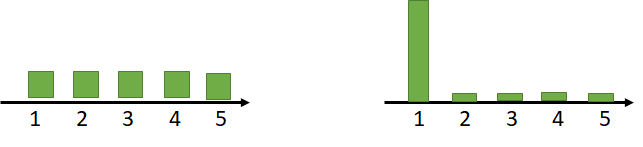
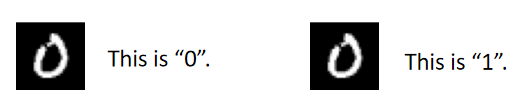
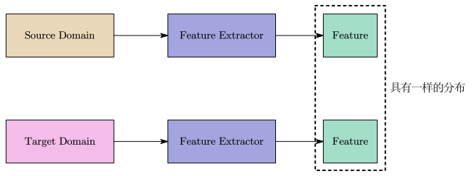
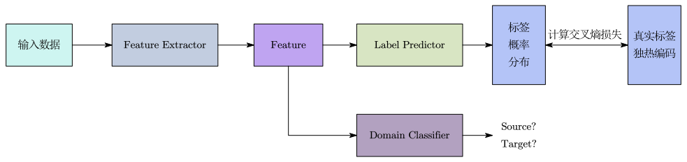

Domain Adaptation 可以看做是 Transfer Learning 的一种：

- Transfer Learning：模型在 A 任务上学到的技能，可以被用在 B 任务上。
- Domain Adaptation：在训练数据的 domain 上得到的模型，用到另外一个测试数据的 domain 上。比如：黑白图像训练出来的模型，用到彩色图像的测试数据上。
- Source Domain：训练数据。
- Target Domain：测试数据。

# Domain Shift

domain shift 意思为训练数据跟测试数据的分布不一样：

- 输入分布不同：例如训练数据的图像是黑白的，但测试数据的图像是彩色的。
- 输出分布不同：例如训练数据每种输出的机率都一样，但在测试数据中，每种输出的机率是不一样的，有可能某一个输出的机率特别大。

- 输入输出的关系发生变化：类似的数据，在训练集和测试集中的标签不一样(不常见)。

# Domain Adaptation

根据 target domain 中资料的情况，大致可以分为以下几种情况：

- 少量有标注的数据
- 大量无标注的数据
- 少量无标注的数据
- 对  target domain 一无所知

## 少量有标注的数据

可以用 target domain 的数据来微调 source domain 训练出来的模型。

方法：已经有一个在 source domain 上训练好的模型，拿 target domain 的数据丢进模型训练即可。

注意：由于 target domain 的数据量很少，所以训练轮数不宜过多，以免有过拟合的情况(2到3轮即可)。

## 大量无标注的数据

基本的想法是：训练一个叫做 feature extractor 的模型，由 feature extractor 提取 source domain 和 target domain 上数据的特征，让提取的特征具有相同的分布。

那么模型的结构就可以分成 feature extractor 及 label predictor 两个部分。例如：前 5 层是 feature extractor，后 5 层是 label predictor 。

### Domain Adversarial Training

类似于 GAN，新增一个 domain classifier 作为判别器 $D$ ，判断输入来自哪个 domain，feature extractor 如同生成器 $G$ ，要想办法骗过 domain classifier 。

设：

- $\mathcal{L}$ 为 label predictor 分类结果与实际分类之间的交叉熵损失。
- $\mathcal{L}_\text{d}$ 为 domain classifier 对 feature extractor 输出的 feature 进行二元分类，判断来自哪个 domain，分类结果与实际分类之间的交叉熵损失。
- $\theta_\text{d}$ 为 domain classifier 的参数。
- $\theta_\text{f}$ 为 feature extractor 的参数。
- $\theta_\text{l}$ 为  label predictor 的参数。

目标：

- 找一组 $\theta_\text{l}$ 让 $\mathcal{L}$ 越小越好。
- 找一组 $\theta_\text{d}$ 让 $\mathcal{L}_\text{d}$ 越小越好。
- 找一组 $\theta_\text{f}$ 让 $\mathcal{L}-\mathcal{L}_\text{d}$ 越小越好(既能使 label predictor 分类准确，又能使 domain classifier 难以分辨)。

### Universal domain adaptation

两个 domain 的类别不一定都完全相同：

- source domain 的类别比较多，而 target domain 的类别比较少	

- source domain 的类别比较少，而 target domain 的类别比较多	

- 两者有交集，但也都各有独有的类别

解决方案：[Universal Domain Adaptation](https://openaccess.thecvf.com/content_CVPR_2019/html/You_Universal_Domain_Adaptation_CVPR_2019_paper.html)

##  少量无标注的数据

target domain 没有标注数据并且数量还很少，甚至只有一张。

解决方案：[Testing Time Training](https://arxiv.org/abs/1909.13231)

## 对 Target Domain 一无所知

1. 如果训练数据非常丰富，具有各式各样不同的 domain 。希望因为训练数据有多个 domain，模型可以学到如何弥补各个 domain 之间的差异，从而处理没在训练数据中学习过的 domain ([Domain Generalization with  Adversarial Feature Learning](https://ieeexplore.ieee.org/document/8578664))

2. 训练数据只有一个 domain，而测试数据有多种不同 domain。在概念上与数据增强类似，从已知 domain 的数据产生多个 domain 的数据([Learning to Learn Single Domain  Generalization](https://arxiv.org/abs/2003.13216))
