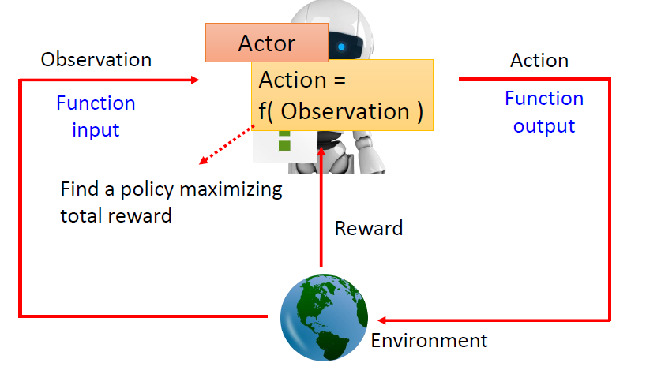
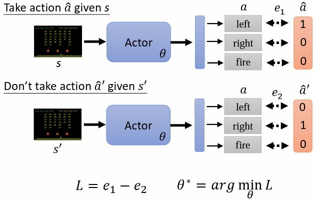
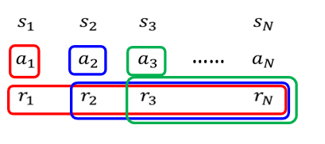
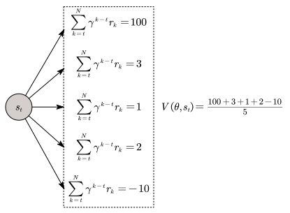
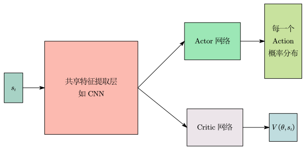
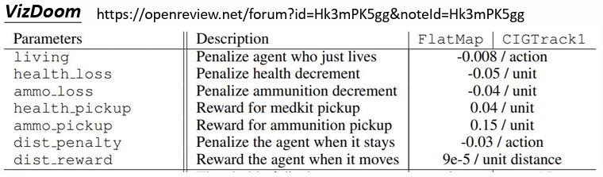

# 什么是强化学习(RL)

强化学习(Reinforcement Learning， RL)是一种实现通用人工智能的可能方法，

强化学习的应用场景：

- 不知道最佳的输出是什么。
- 收集有标注的资料有难度。
- 目标函数根本不可导。
- 决策具有连续性和延迟性。
- 能够通过与环境交互进行探索。
- 拥有低成本或高精度的模拟器。

## Actor

强化学习中有 Actor 及 Environment，Actor 以 Environment 提供的 Observation 作为输入，输出 Action 影响 Environment，Environment 受到 Action 的影响产生新的 Observation，Environment 会不断地给 Actor 一些 Reward，告诉他采取的 Action 好不好。

Actor 就是强化学习所要找的函数，输入为 Observation，输出为 Action，函数的目标是最大化从 Environment 获得的 Reward 总和。

## 训练三步骤

### Step 1. 带有未知参数的函数

Actor 就是一个神经网络，称为 Policy Network。

网络的架构可以是：前馈网络、CNN、Transformer 等等。

输入：Environment 提供给 Actor 的Observation，表示为向量或矩阵。

输出：每一个 Action 的概率分布。

在训练阶段，Actor 做出的 Action 并不是直接选概率最大的那一个，而是根据概率分布进行随机采样，所以即使是概率最低的 Action，仍然有被尝试的可能。这样做是因为：如果每次都只选概率最大的 Action 会很容易陷入局部最优，永远无法发现可能带来更高奖励的潜在 Action 。

在测试和推理阶段，为了追求稳定性和收益最大化，这时模型会直接选择概率最大的那个 Action。

### Step 2. 定义目标函数

Actor 在时刻 $t$ 接收到的关于 Environment 当前情况的 Observation 记为 $s_t$，并在状态 $s_t$ 下做出 Action 记为 $a_t$ ，Environment 在 Actor 执行动作 $a_t$ 并转移到新状态 $s_{t+1}$ 后，给 Actor 一个 Reward 记为 $r_t$ 。

Actor 与 Environment 交互产生的一系列“状态-动作-奖励”的序列，称为轨迹(Trajectory)，通常记为：

$$
\tau = (s_1, a_1, r_1, s_2, a_2, r_2, \dots, s_T).
$$

当这个序列到达一个终止状态时，这一个完整的序列就称为一个 Episode。把所有的 Reward 相加得到整个 Episode 的 Total Reward，又称为 Return 。目标是最大化 Return，所以目标函数即为 -Return 。

### Step 3. 最优化

Reward 是一个函数，输入是 $s_i$ 和 $a_i$ ，输出 $r_i$ 。

目标是：找到 actor 的一组参数，使得所有的 $r_i$ 的和达到最大。

问题：

- 训练阶段，action 是随机采样产生的，所以给定相同的 $s$，产生的 $a$ 可能不一样。
- Environment 和 Reward 很有可能具有随机性。

## RL 与 GAN 的异同

| | GAN | RL |
| :--- | :--- | :--- |
| 相同 | 训练 generator 时，会把 generator 跟 discriminator 接在一起，调整 generator 的参数让 discriminator 的输出越大越好 | RL 中，actor 如同 generator，environment 跟 reward 如同 discriminator，调整 actor 的参数，让 environment 跟 reward 的输出越大越好 |
| 相异 | GAN 的 discriminator 是一个 neural network | reward 跟 environment 不是 network，是一个黑盒，无法用一般梯度下降法来调整参数，来得到最大的输出 |

# 优化方法：策略梯度(Policy Gradient)

由于环境和奖励的随机性，且目标函数是离散的回报值，根本不可导，导致强化学习的优化问题不是一般的优化的问题，所以在优化的步骤跟一般的方法不同，要使用策略梯度等优化方法。

## 如何控制 Actor

若希望 actor 在看到某个 $s$ 时采取某一 Action，只需将其看做一般的分类问题即可，为其设定标签，计算 Actor 输出与标签的交叉熵损失即可。

如果想要让智能体看到某个 $s$ 时不要采取某一 Action，只需要在定义损失的时候使用负的交叉熵损失。

收集一堆某一 Observation 下应该采取(+1)或不采取(-1)某一 Action 的数据 $\{s_i,a_i\}$ ，损失函数定义为：
$$
\mathcal{L}=e_1-e_2+e_3-\cdots-e_N.
$$
如果考虑动作执行程度的差别，那么可以给每个 $e_i$ 乘上一个分数 $A_i$ ，$A_i > 0$ 代表希望执行，$A_i < 0$ 代表不希望执行。$A_i$ 越正代表希望的程度越高，$A_i$ 越负代表不希望的程度越高，损失函数变为：
$$
\mathcal{L}=\sum_{i=1}^{N}A_ie_i.
$$

## 如何定义 $A_i$

### Version 0(无效)

1. 首先定义一个随机的 Actor，记录若干个 Episodes 中 Actor 与环境互动时，面对每一个 $s_i$ 产生的 $a_i$ 。

2. 计算每个 $s_i$ 和 $a_i$ 产生的 Reward $r_i$ 。

3. 将 Reward 就作为 $A_i$ 。

这样的做法导致模型短视近利，没有长程规划的概念。因为：

- 每一个行为并不是独立的，每一个行为都会影响到接下来发生的事情。

- Reward Delay：可能需要牺牲短期的利益换取长期利益。

### Version 1(Cumulated Reward)

$a_i$ 有多好，不仅取决于 $r_i$ ，也取决于 $a_i$ 之后所有的 Reward，也就是把 $a_i$ 及之后的所有 Action 得到的 Reward 通通加起来，得到 $A_i$ (cumulated reward)：

$$
A_i = \sum_{k=i}^{N}r_k.
$$

问题：当一个 Episode 非常长时，将很后面的 Reward 归功于前面的 Action 也不合适。

### Version 2(Discounted Cumulated Reward)

改良 Version 1 的问题，新增 discount factor $\gamma(\gamma<1)$，离 $a_i$ 比较近的 Reward 给予较大的权重，较远的 Reward 给予较小的权重，使较远的 Reward 影响变小：

$$
A_i = \sum_{k=i}^{N}\gamma^{k-i}r_k.
$$

### Version 3(标准化)

如果得到的 Reward 永远都是正的，只是有大有小不同，因此每个 $A_i$ 都会是正的，就算某些行为是不好的，还是会鼓励机器采取某些行为，所以需要做标准化，改良 Version 2，把所有 $A_i$ 减一个 baseline $b$ ：

$$
A_i \leftarrow A_i - b.
$$

### Version 3.5

训练一个 [Critic](#Critic)，给一个 Observation $s$，输出 $V(\theta,s)$，让Version 3 中的 $b=V(\theta,s)$ ：

$$
A_i = \left(\sum_{k=i}^{N}\gamma^{k-i}r_k\right) - V(\theta,s_i).
$$

$V(\theta,s_t)$ 可以视为在 Observation $s_t$ 下，后续 Actor 随机采取各种可能的 Action 后得到的 [Discounted Cumulated Reward](#Discounted Cumulated Reward) $\displaystyle\sum_{k=t}^{N}\gamma^{k-t}r_k$ 的期望值。

$\displaystyle\sum_{k=t}^{N}\gamma^{k-t}r_k$ 则是真正结束一个 Episode 后，得到的 [Discounted Cumulated Reward](#Discounted Cumulated Reward) 。

$A_t$ 是对 Actor 在 Observation $s_t$ 下，采取 Action $a_t$ 的评价：
- 若 $A_t > 0$，意义为采取特定的 Action $a_t$ 得到的 [Discounted Cumulated Reward](#Discounted Cumulated Reward) $\displaystyle\sum_{k=t}^{N}\gamma^{k-t}r_k$ 比随机选择一个 Action 的期望值 $V(\theta,s_t)$ 好，所以给予 $a_t$ 正面的评价。
- 若 $A_t < 0$，意义为采取特定的 Action $a_t$ 得到的 [Discounted Cumulated Reward](#Discounted Cumulated Reward) $\displaystyle\sum_{k=t}^{N}\gamma^{k-t}r_k$ 比随机选择一个 Action 的期望值 $V(\theta,s_t)$ 差，所以给予 $a_t$ 负面的评价。

$A_i = \left(\displaystyle\sum_{k=i}^{N}\gamma^{k-i}r_k\right) - V(\theta,s_i)$ 表示表示用一次随机采样的结果减去所有可能结果的“平均”，不够准确。

### Version 4

在 Observation $s_t$ 下，采取 Action $a_t$ 后到 $s_{t+1}$，考虑在 Observation $s_{t+1}$ 下随机采取各种可能的 Action 后得到的 [Discounted Cumulated Reward](#Discounted Cumulated Reward) $\displaystyle\sum_{k=t+1}^{N}\gamma^{k-(t+1)}r_k$ 的期望值，即 $V(\theta,s_{t+1})$ 。

通过[时序差分法](#时序差分法)，知道理想情况下 $V(\theta,s_t)$ 和 $V(\theta,s_{t+1})$ 之间存在关系：

$$
V(\theta,s_t) = r_t + \gamma V(\theta,s_{t+1}).
$$

所以 $A_t$ 就定义为：

$$
A_t = r_t + \gamma V(\theta,s_{t+1}) - V(\theta,s_t).
$$

$A_t > 0$ 说明：实际收益 $r_t + \gamma V(\theta,s_{t+1})$ 大于预期 $V(\theta,s_t)$ 。

## 具体训练过程

1. 随机初始化 Actor 参数 $\theta_0$ 。
2. 对于训练迭代 $i = 1$ 到 $T$ ：
    用参数为 $\theta_{i-1}$ 的 Actor 与 Environment 做交互。
    搜集数据$\{s_1,a_1\},\cdots,\{s_N,a_N\}$ 。
    计算 $A_1, \cdots , A_N$ 。
    计算损失 $\mathcal{L}$ 。
    梯度下降更新参数 $\theta_i \leftarrow \theta_{i-1}-\eta \nabla \mathcal{L}$ 。

每次更新完一次参数以后，数据就要重新再收集一次，此举非常花时间。因为通过参数为 $\theta_{i-1}$ 的 Actor 收集到的数据，不一定适合拿来做为参数为 $\theta_i$ 的 Actor 的数据。

### On-policy vs Off-policy

On-policy Learning：训练的 Actor 跟与 Environment 互动的 Actor 是同一个。

Off-policy Learning：训练的 Actor 跟与 Environment 互动的 Actor 是不同的。好处是不用一直收集资料，可以用一次收集到的资料，更新多次 Actor 。

### Exploration

Actor 所采取的 Action 是随机采样而来的，因此 Actor 采取的 Action 具有随机性。

若一个 Actor 采取行为的随机性不够，则一个 Episode 结束后，所搜集到的数据中有些 Actions 根本没有被随机采样到，会导致无从知道这些 Actions 的好坏。

所以期望跟 Environment 互动的 Actor 采取 Actions 的随机性要够大，如此才能收集到比较丰富的资料。因此在训练时，可由以下方式解决：

1. 刻意加大 Actor 输出的 Actions 概率分布的熵(让各种 Actions 的概率分布非常均匀)
2. 在 Actor 的参数上加噪声。
3. $\cdots$

# Critic 

## Value Function

若当前 Actor 参数为 $\theta$ ，当前的 Observation 为 $s$ ，Value Function $V(\theta ,s)$ 为基于参数为 $\theta$ 的 Actor 及 Observation $s$ 所预期的 [Discounted Cumulated Reward](#Discounted Cumulated Reward)(期望值，因为环境有随机性、策略有随机性，从同一个状态 $s$ 出发，会有多种可能的未来轨迹，从而有多种不同的 [Discounted Cumulated Reward](#Discounted Cumulated Reward))。

Critic 做的事就是在只看到当前的Observation $s$ 而尚未完成所有交互前，就得到对参数为 $\theta$ 的 Actor 的评价 $V(\theta ,s)$ 。

## 如何训练 Critic

### 蒙特卡洛法

让 Actor 去跟 Environment 互动很多 Episodes，得到一些训练资料。

针对某一笔训练资料，其 Observation 为 $s_a$ ，$V(\theta,s_a)$ 要与 [Discounted Cumulated Reward](#Discounted Cumulated Reward) 越接近越好。

### 时序差分法 

Actor 不需与 Environment 进行完整交互(一个 Episode)得到训练资料。只要在看到 Observation $s_t$ ，Actor 执行 Action $a_t$，得到 Reward $r_t$ ，接下来再看到 Observation $s_{t+1}$，就能够更新一次 Critic 参数。此方法非常适合一个 Episode 所需时间很长的交互过程或根本无法终止的交互过程。

先不考虑期望，$V(\theta,s_t)$ 和 $V(\theta,s_{t+1})$ 可以写成：

$$
V(\theta,s_t)=r_t+\gamma r_{t+1} + \gamma^2 r_{t+2} + \cdots,\\
V(\theta,s_{t+1})=r_{t+1} + \gamma r_{t+2} + \cdots.\\
$$

那么理想情况下 $V(\theta,s_t)$ 和 $V(\theta,s_{t+1})$ 之间存在关系：

$$
V(\theta,s_t) = r_t + \gamma V(\theta,s_{t+1}).
$$

所以拥有训练数据 $s_t, a_t, r_t, s_{t+1}$ ，即可计算 $V(\theta,s_t)-\gamma V(\theta,s_{t+1})$ ，希望其与 $r_t$ 越接近越好。

# Actor-Critic 网络架构

Actor 与 Critic 都是一个神经网络，两者皆以 Observation $s$ 作为输入，Actor 输出每一个 Action 的概率分布，Critic 输出一个标量 $V(\theta,s_t)$ 。由于输入是一样的东西，所以这两个网络应该有部分的参数可以共用。

# Reward Shaping

如果 Reward 大多数情况都是0，只有在少数情况是一个非常大的数值，这意味着很多 Actions 无从判断是好是坏。例如：围棋到结束才会有 Reward，过程中都没有 Reward 。

解决方法：Reward Shaping ，就是定义一些额外的 Reward 来帮助 Actor 学习。例如：射击类游戏，除赢得胜利得到正的Reward及输掉游戏得到负的 Reward 外，额外定义了其他行为可以得到正的或负的 Reward，如：

Reward Shaping 都要倚靠人类的专业知识来定义。

Reward Shaping 的其中一种做法是：Curiosity Based Reward Shaping。基本的想法就是当智能体看到一些新的东西，就给予其一定的 Reward 。

# No Reward : Imitation Learning

某些任务要定义 Reward 很困难。

人工设置一些 Reward(reward shaping) 时，若 Reward 设定的不好，机器可能会产生奇怪、无法预期的行为。

## Imitation Learning

没有 Reward 的状况下，可使用 Imitation Learning 。

引入 Expert(通常为人类)的示范。 找很多 Experts 跟环境互动，记录互动的结果 $\hat{\tau}$ ，每个 $\hat{\tau}$ 代表一个 Trajectory 。例如：自动驾驶学习人类驾驶员的的驾驶行为。

### Behavior Cloning

类似于监督式学习，让机器做出的 Action 跟 Export 做出的 Action 越接近越好，又称作 Behavior Cloning 。

问题：

- Experts 的与环境互动的记录有限，若 Actor 遇到从没见过的情境，可能会做出无法预期的 Action 。

- Experts 做出的一些 Actions，Actor 并不一定需要学习模仿，因为可能不会带来好的结果。

### Inverse Reinforcement Learning

从 Expert 的示范，还有 Environment 去反推 Reward Function，学出一个 Reward Function 后，再用一般的强化学习来训练 Actor 。

找出 Reward Function 的原则：老师的行为总是最好的。

基本步骤：

1. 初始化一个 Actor 。

2. Actor 与环境互动获得多个 Trajectory $\{\tau_1, \cdots, \tau_k\}$ 。

3. 定义(更新)一个 Reward Function，能够使老师的 Reward 总和 $\displaystyle\sum_{i=1}^k R(\hat{\tau}_i)$ 比 Actor 的 Reward 总和 $\displaystyle\sum_{i=1}^k R(\tau_i)$ 更高 。

4. 利用定义的 Reward Function 进行训练，更新 Actor 的参数，使 Actor 能够最大化 Reward 。

5. 重复 2—4 ，迭代训练，最后输出 Reward Function 以及训练得到的 Actor 。

IRL 就如同 GAN，Actor 可视为 Generator，Reward Function 可视为 Discriminator 。
