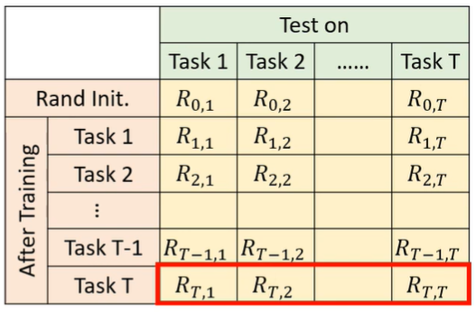
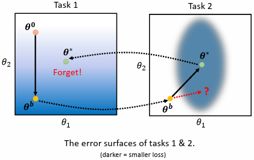
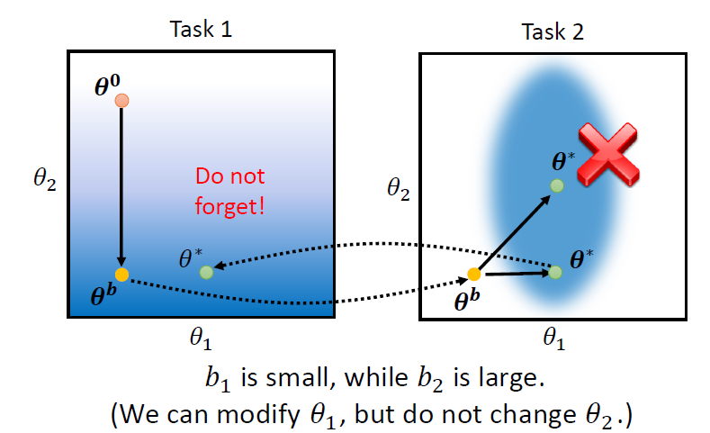
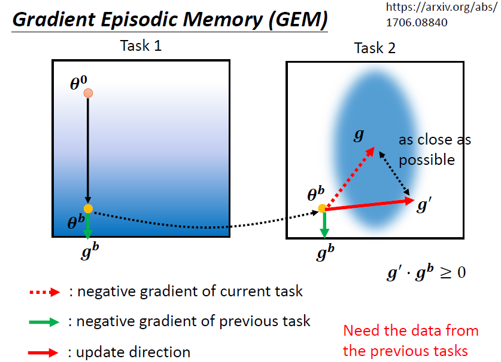
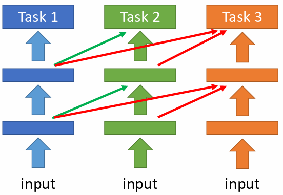
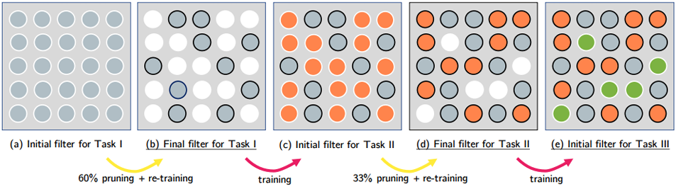
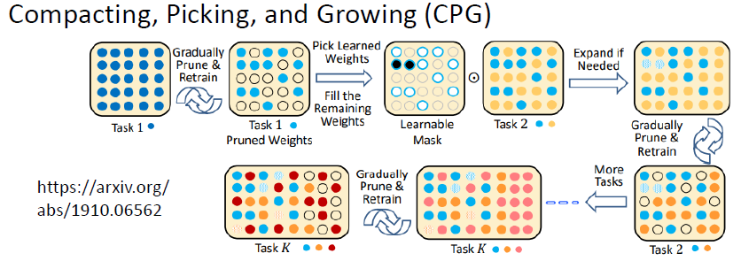
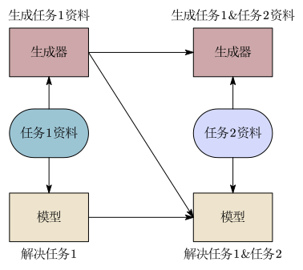

# 基本概念

Life Long Learning，又称为 Continual Learning、Never Ending Learning、 Incremental Learning

Life Long Learning 期望机器不断学习新的任务(不同领域的类似任务)。

灾难性遗忘(Catastrophic Forgetting)：机器学习了新的任务后，在旧的任务上的表现变差了。

多任务训练(Multi-Task Training)：让机器同时利用多个任务的数据进行学习。某种程度上可以解决遗忘的问题，但当机器要学新的任务时，都要把之前学过的任务资料也都重新一起带入训练，时间和空间难以负荷。

Train a model for each task：针对每一个具体的任务都单独、独立地训练一个专用的模型。但最终会导致模型过多无法储存且信息和数据不能在不同的任务间迁移。

终身学习与迁移学习的区别：

- 终身学习关注的是机器学完新的任务后，还能不能够解旧的任务。
- 迁移学习关注的是机器学习完旧的任务后，能不能够对新的任务有帮助。

# 终身学习的评估方法

机器需要面对一系列的任务：任务 1、任务 2、$\cdots$ 、任务 $T$ 。机器依序学习各个不同的任务，每学完一个新任务就在所有任务的测试数据上计算正确率，这样就有了一个评估矩阵：

$R_{i,j}$表示学完任务 $i$ 后在任务 $j$ 上的表现：

- $i > j$ 就代表机器学了任务 $i$ 后，在之前学过的任务 $j$ 上的表现。

- $i < j$ 就代表机器还没学任务 $j$，只学到任务 $i$，此时在任务 $j$ 上的表现。

三种评估指标：

- Accuracy：学完所有任务后，各个任务的平均表现： $\displaystyle\frac{1}{T}\sum_{i=1}^T R_{T,i}$ 。
- Backward Transfer：衡量学了新知识后，对旧知识的影响(遗忘或促进)：$\displaystyle\frac{1}{T-1}\sum_{i=1}^{T-1} \left(R_{T,i}-R_{i,i}\right)$ 。通常是负的，代表灾难性遗忘，负得越多，忘得越狠。
- Forward Transfer：还未学习任务 $i$，只学习了前 $i-1$ 个任务，此时在任务 $i$ 的表现：$\displaystyle\frac{1}{T-1}\sum_{i=2}^{T} \left(R_{i-1,i}-R_{0,i}\right)$ 。

# 为什么会有灾难性遗忘

假设现在模型只有两个参数 $\boldsymbol{\theta}=\{\theta_1,\theta_2\}$ ，参数在不同任务上有不同的 error surface。

先用 task 1 训练模型，随机初始化参数 $\boldsymbol{\theta}_0$，用梯度下降更新参数得到 $\boldsymbol{\theta}_b$ 。

将 $\boldsymbol{\theta}_b$ 作为初始参数用 task 2 训练模型，使用梯度下降更新参数得到 $\boldsymbol{\theta}^*$ 。

由于两个任务的 error surface 不同，拥有小的 loss 所对应的参数不同，进而导致灾难性遗忘。

如果能够让参数往 task 2 的椭圆 error surface 下缘靠近，那么在两个任务上都能有不错的表现。

# 终身学习的三种方法

## 选择性突触可塑性(Selective Synaptic Plasticity)

对于旧的任务所学习到的参数有“重要”与“不重要”的区别，在学习新的任务时，针对重要的参数尽量维持不变，只改变不重要的参数。

假设 $\boldsymbol{\theta}_b$ 是在任务 1 上学习得到的参数组合，$\boldsymbol{\theta}_b$ 中每一个参数 $\theta_i$ 都有一个 guard $b_i$ 。

假设 $\mathcal{L}_1(\boldsymbol{\theta})$ 是任务 1 的损失函数，那么在使用任务 2 训练时，损失函数改写为：

$$
\mathcal{L}_2(\boldsymbol{\theta}) = \mathcal{L}_1(\boldsymbol{\theta}) + \lambda \sum_{i} b_i(\theta_i^\prime - \theta_i)^2.
$$

$\theta_i^\prime$ 就是新学到的参数，$b_i$ 就代表这一个参数对任务 1 的重要程度：

- $b_i$ 越大，就代表越希望新的参数 $\theta_i^\prime$ 与原来 $\theta_i$ 越接近。若 $b_i=+\infty$ ，则强烈希望新的参数 $\theta_i^\prime$ 与原来 $\theta_i$ 相等，会导致会导致 intransigence(在新的任务学不好)
- $b_i$ 越小，就代表不在乎新的参数 $\theta_i^\prime$ 与原来 $\theta_i$ 是否接近。若 $b_i=0$ ，则会导致灾难性遗忘。

### 如何设定 $b_i$

$b_i$ 通常是人工设定，基本思路是在任务 1 上训练好后得到一组参数 $\boldsymbol{\theta}_b$ ，逐一调整 $\boldsymbol{\theta}_b$ 的每个参数 $\theta_i$ ，观察对任务 1 loss 的影响，例如：

- 调整 $\theta_1$ 后对任务 1 的 loss 影响较小，代表 $\theta_1$ 对任务 1 来说不太重要，则将 $b_1$ 设置的比较小。
- 调整 $\theta_2$ 后对任务 1 的 loss 影响较小，代表 $\theta_2$ 对任务 1 来说比较重要，则将 $b_2$ 设置的比较大。

最终，在任务 2 上调整完参数后，机器在任务 1 和任务 2 上都有较好结果：

### Gradient Episodic Memory

不在参数上做限制，而是在梯度更新的方向上做限制。

假设在任务 1 上训练好后得到一组参数 $\boldsymbol{\theta}_b$ ，在这组参数下，分别计算在任务 1 和任务 2 上的梯度方向 $\boldsymbol{g}_1$ 和 $\boldsymbol{g}_2$ ，然后让两者做点积，如果 $\boldsymbol{g}_1 \cdot \boldsymbol{g}_2 < 0$ ，则修改 $\boldsymbol{g}_2$ 变为 $\boldsymbol{g}_2^\prime$ 使得 $\boldsymbol{g}_1 \cdot \boldsymbol{g}_2^\prime \geqslant 0$ 且 $\boldsymbol{g}_2^\prime$ 与 $\boldsymbol{g}_2$ 的距离越近越好。

## 额外神经资源分配(Additional Neural Resource Allocation)

### Progressive Neural Network

冻结旧任务的模型参数，在新任务到来时横向扩建新网络列，通过侧向连接复用旧知识：

### PackNet

先分配一个较大的模型，每当训练新任务时，模型并不是让所有参数都参与更新，而是旧任务所需的核心参数会被冻结起来不参与更新：

### CPG(Progressive Neural Network + PackNet)

模型既可以增加新的参数，且在训练新任务时，模型并不是让所有参数都参与更新，而是旧任务所需的核心参数会被冻结起来不参与更新。

只要原网络还有空间，新任务就只用剩下的一部分参数去练(PackNet )，如果原网络的所有参数都被冻结，模型就会动态增加新参数(PNN 扩容)。

## 记忆重放(Memory Replay)

针对当前任务，除了训练模型外，还额外训练 Generator ，能够产生以前的旧任务以及当前任务的资料。

当又有一个新任务时，就将 Generator 产生的资料和新任务的资料一起拿来训练新任务模型，同时也训练一个新的 Generator 来给下一次的新任务使用：

额外训练 generator 同样会占用空间，但如果这个空间比储存训练数据占用的空间小，那就是一个有效的方法。实际上，这个方法可以做到跟 Multi-Task Training 差不多的效果。
