网络压缩想要做的事情就是：把网络部署在有限的算力下，拥有较少的参数量，并能达到与原来差不多的性能。

五个神经网络压缩技术(软件技术)：

- 网络剪枝(Network Pruning)
- 知识蒸馏(Knowledge Distillation)
- 参数量化(Parameter Quantization)
- 架构设计(Architecture Design)
- 动态计算(Dynamic Computation)

在做网络压缩的时候，可以既用架构设计的方法，又用知识蒸馏的方法，还可以在用完知识蒸馏以后，再去做网络剪枝，还可以在做完网络剪枝以后，再去做参数量化。如果想要把网络压缩到很小，这些方法都是可以一起被使用的。  

# 网络剪枝

大的网络里面有很多很多的参数，每一个参数不一定都有用，这些没有用的参数占用了很多无效空间，浪费计算资源。所以网络剪枝就是找出一个大的网络中没有用的那些参数，然后扔掉。

网络剪枝基本思路：

- 首先，先训练一个大的网络。
- 然后衡量这个大的网络里面每一个参数或者是每一个神经元的重要性，把不重要的神经元或是不重要的参数扔掉。
- 修剪以后，通常网络的性能就会下降，可以再重新做微调让性能回升。
- 以上步骤可以做多次，通常一次不会修剪掉大量参数，因为如果一次剪掉大量的参数，可能导致用微调后也没有办法复原网络性能。

## 参数修剪 vs 神经元修剪

### 参数修剪

将不重要的参数去掉以后，得到的网络的形状可能会是不规则的，代码上难以实现也难以使用 GPU 加速；即使把那些修剪掉的权重直接设置为 0，这样并不代表修剪掉的权重不存在，只是值设为零，这样就比较容易实现和用 GPU 加速，但根本就没有真的把网络变小：

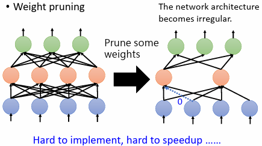

### 神经元修剪

丢掉一些神经元以后，网络的架构仍然是规则的，代码上比较好实现也比较好用 GPU 来加速：

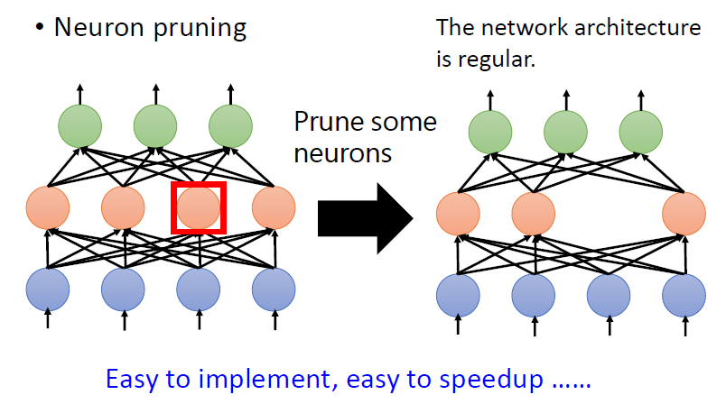

### 为什么必须是修剪

问题：先训练一个大的网络，再把它变小，并且小的网络跟大的网络的性能没有差太多，那为什么不直接训练一个小的网络就好了。

原因：大的网络比较好训练，如果直接训练一个小的网络，往往没有办法得到跟大的网络一样的性能。

### 彩票假说(Lottery Ticket Hypothesis)：

每次训练网络的结果不一定会一样，如果抽到一组好的初始的参数，就会得到好的结果；抽到一组坏初始的参数，就会得到坏的结果。

如何在彩票中有更大的中奖机会，最简单的办法就是多买，对网络训练来说也是一样的。大的网络可以视为是很多小的子网络的组合。训练这个大的网络的时候，等于同时训练很多小的网络。每一个子网络不一定可以训练出一个好的结果，但是在众多的子网络里面，只要其中一个子网络成功，大网络就成功了。

如果大的网络里面包含的小的网络越多，就好像是买更多的彩票，中奖的机会就越大，所以一个网络越大，它就越有可能训练出一个好的结果。

实验上，先随机初始化大网络的参数，然后训练得到一组训练完的参数。然后剪枝得到一个比较小的网络，对这个小网络做两种操作：

- 选取原来的随机初始化参数，训练成功。
- 用和原来不一样的随机初始化，训练失败。

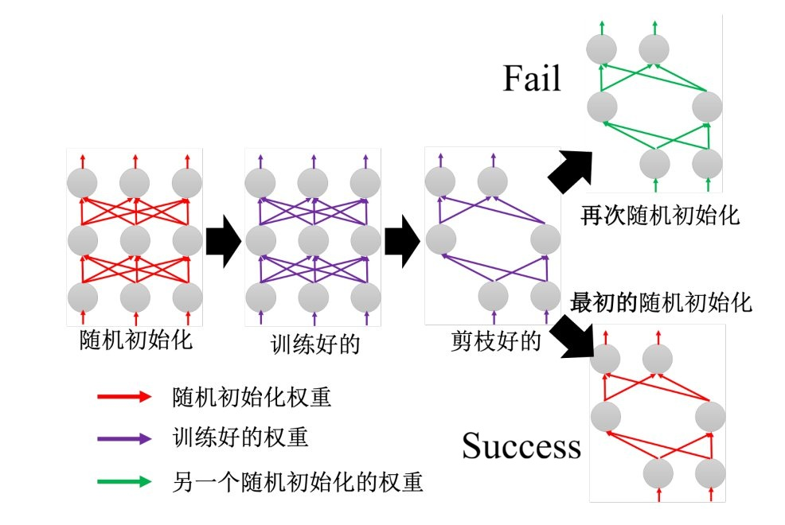

# 知识蒸馏

先训练一个大的网络(教师网络)，再根据这个大的网络来制造一个小的网络(学生网络)。

知识蒸馏与网络剪枝差别：

- 网络剪枝：直接把大的网络里面一些参数(神经元)拿掉，就把它变成小的网络。
- 知识蒸馏：学生网络是根据教师网络学习得到的。

以手写辨识为例，教师网络输出数字 0—9 的概率分布，学生网络的输出也是数字 0—9 的概率分布并期望与教师网络的结果越接近越好：

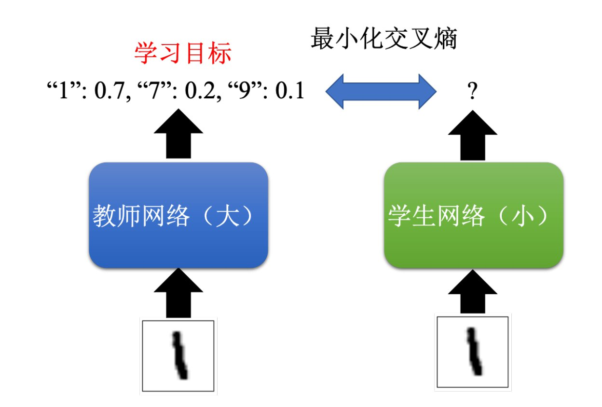

## Temperature for softmax

softmax 做的事情就是将网络的输出变成介于 0 到 1 之间的概率，而原始的 softmax 可能会有概率分布集中的问题，这样就相当于直接给学生网络正确的答案，对于学生网络来说没什么帮助。

解决方法就是新增超参数 Temperature $T$ ，使得最后的概率分布变得平滑：

$$
y_i^\prime = \displaystyle\frac{e^{y_i}}{\displaystyle\sum_{j}y_j} \to y_i^\prime = \displaystyle\frac{e^{\frac{y_i}{T}}}{\displaystyle\sum_{j}\frac{y_j}{T}}.
$$

例如 $y_1=100,y_2=10,y_3=1$ ，那么 softmax 后 $y_1^\prime \approx 1,y_2^\prime \approx 0,y_3^\prime \approx 0$ 。

如果 $T = 100$ ，那么 softmax 后 $y_1^\prime \approx 0.56,y_2^\prime \approx 0.23,y_3^\prime \approx 0.21$ 。

假设 $T$ 接近无穷大，这样所有的类别的概率分布就变得差不多，学生网络也学不到东西了，因此 $T$ 是在做知识蒸馏的时候要调的超参数。

# 参数量化

参数量化的目的是用比较少的空间来储存一个参数，一般存储参数的时候可能是用 64 位或 32 位，但可能不需要这么高的精度，用 16 或 8 位就够了。

最简单的做法就是直接减少参数存储的位数(比如 16 位变 8 位)，性能不会下降很多，甚至有时候把储存参数的精度变低，结果还会稍微更好一点。

## 权重聚类(weight clustering)

根据参数值接近程度将参数分群，让同一群的参数有一样的数值(取同一群参数的平均)，并建立一个表格存储每一个群的值：

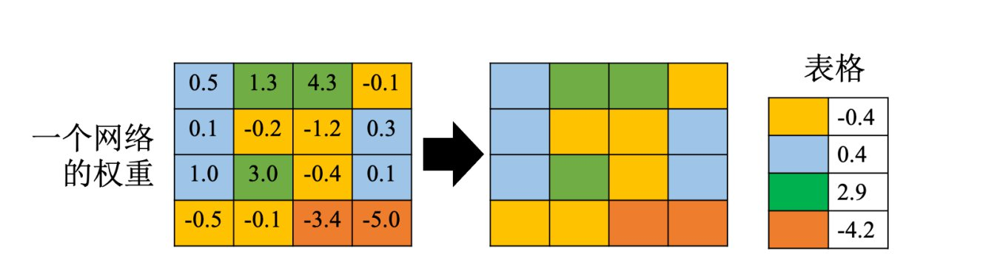

## 哈夫曼编码(Huffman encoding)

出现频率高的东西就用比较少的位来描述它，出现频率低的东西就用比较多的位来描述它，这样平均起来，储存数据需要的位数就变少了。

## 二值权重

网络里面的参数不是 +1，就是 -1，那么每一个参数只需要一位就可以存下来了。这种网络的性能不一定会很差，甚至可能还比正常的网络的性能好一点。

# 架构设计

## 深度可分离卷积(Depthwise Separable Convolution)

深度可分离卷积分成两个步骤：

1. 深度卷积(Depthwise Convolution)
2. 点卷积(Pointwise Convolution)

### 标准卷积

标准的卷积层中，每个卷积核的通道数与输入通道数相同：

### 深度卷积

在深度卷积中，输入有几个通道，就有几个卷积核，每个卷积核都是单通道的，一个卷积核负责输入的一个通道：

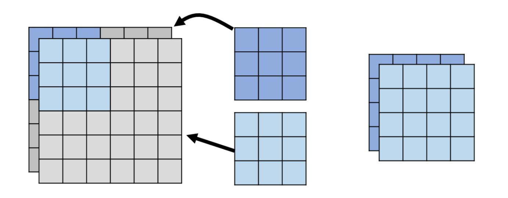

深度卷积的输入通道和输出通道数相同

如果只做深度卷积，那么输入的每个通道之间没有任何的互动，假设有某一个模式是跨通道才能够看得出来的，深度卷积对这种跨通道的模式是无能为力的。

### 点卷积

点卷积能够考虑输入的通道间关系，做完深度卷积后再进行点卷积。

点卷积与标准卷积一样，每个卷积核的通道数与输入通道数相同。因为只要考虑通道间的关系，不需要考虑同一通道相邻元素间的关系，所以限制卷积核每个通道的大小为 $1 \times 1$ ：

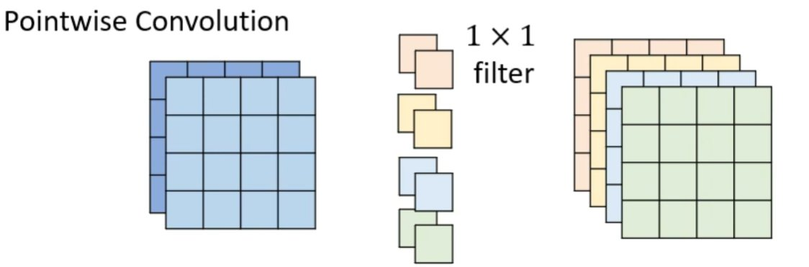

点卷积的输入通道和输出通道数可以不同。

### 标准卷积与深度可分离卷积参数量对比

输入通道数 $I$ ，输出通道数 $O$ ，核大小都是 $k\times k$ 。

标准卷积参数量为 $(k\times k) \times I \times O$ ，深度可分离卷积参数量为 $(k\times k) \times I + (1\times 1)\times I\times O$ 。

参数量之比为：

$$
\frac{(k\times k) \times I + (1\times 1)\times I\times O}{(k\times k) \times I \times O} = \frac{1}{O} + \frac{1}{k\times k}.
$$

由于输出通道数 $O$ 通常比较大，所以先忽略 $\displaystyle\frac{1}{O}$ ，深度可分离卷积参数量基本上就是标准卷积参数量的 $\displaystyle\frac{1}{k\times k}$ ，假设核大小是 $3\times 3$，参数量就变成原来的 $\displaystyle\frac{1}{9}$ ：

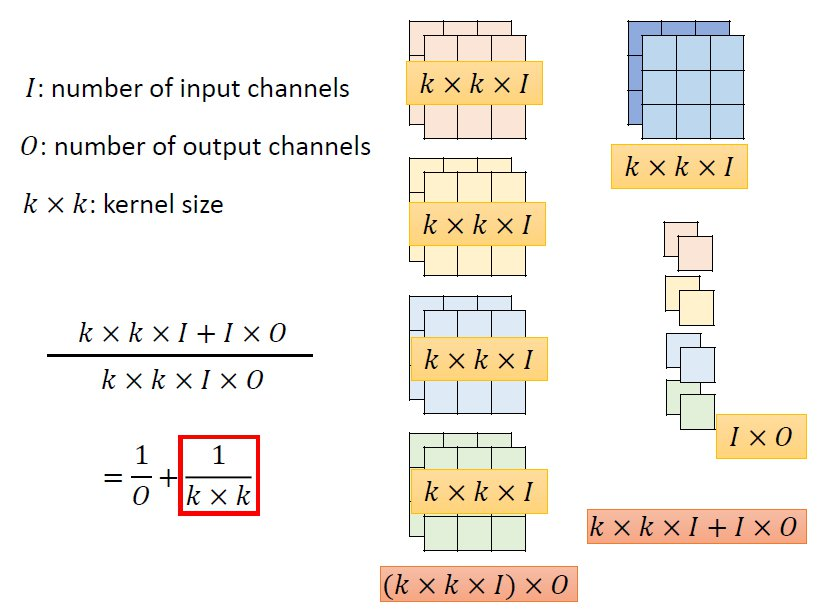

## 低秩近似(low rank approximation)

在深度可分离卷积之前，就已经有一个方法是用低秩近似来减少一层网络的参数量。

假设输入是 $N$ 个神经元，输出是 $M$ 个神经元，这两层之间的参数量是 $N \times M$。只要 $N$ 跟 $M$ 其中一者很大， $\boldsymbol{W}$ 的参数就很多了。为了减少参数量，可以在中间新增一层线性层，线性层神经元数目是 $K$ 。

原参数量是 $N \times M$，新增加一层线性层后，参数量减少为 $N\times K + K\times M$，若 $K$ 远小于 $M$ 跟 $N$，那么参数量就减少了许多。

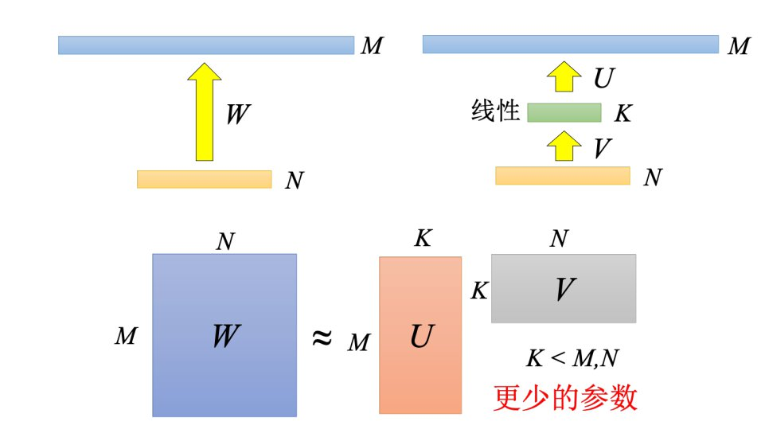

深度可分离卷积就是把一层的网络拆解成两层的网络，其原理跟低秩近似是一样的。

# 动态计算

前几个方法就是单纯的把网络变小，而动态计算希望网络可以自由地调整它需要的计算量。因为需要让模型运行在不同的设备上，而不同的设备上面的计算资源是不太一样的。

## 动态深度

在网络每一层中间再加上一个额外的层。这个额外的层的工作是根据每一个隐藏层的输出决定现在分类的结果。当计算资源比较充足的时候，可以让这张图片去跑过所有的层，得到最终的分类结果。当计算资源不充足的时候，可以让网络决定它要在哪一个层自行做输出：

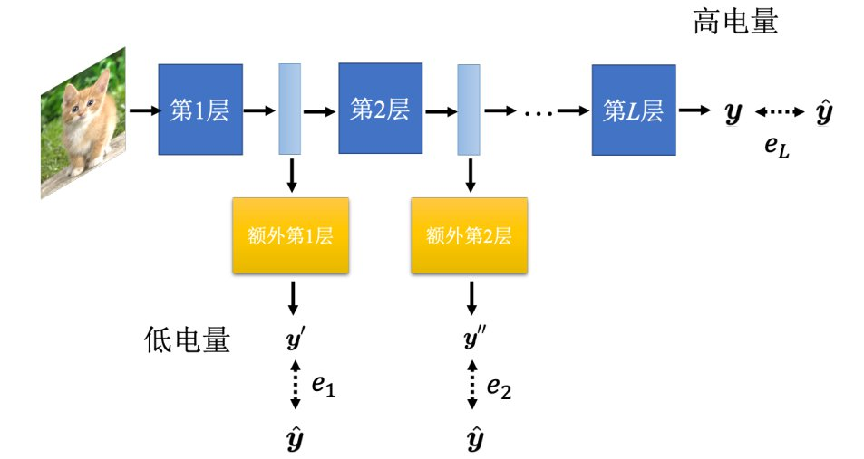

真实标签要跟每一个额外的层的输出越接近越好，因此把所有的输出跟真实标签的交叉熵损失求和得到总损失 $\mathcal{L}$ ，目标就是最小化总损失 $\mathcal{L}$ 。

这个方法可以达到动态深度的目的，但是其实它不是一个最好的方法。

## 动态宽度

在同一个网络中，设定好几个不同的宽度：

将不同宽度下产生的每一个输出跟真实标签的交叉熵损失求和得到总损失 $\mathcal{L}$，目标就是最小化总损失 $\mathcal{L}$ ：

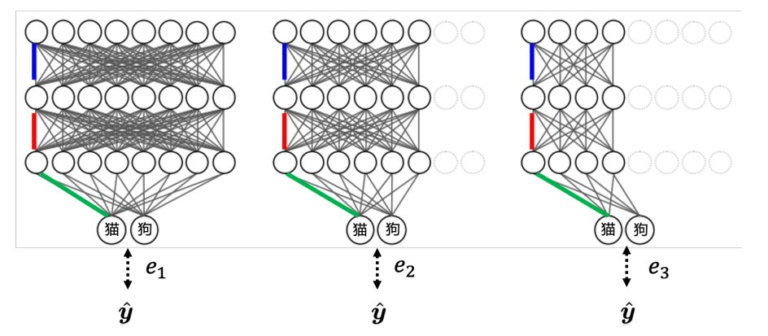

## 网络自行决定深度跟宽度

上面的两种方法还是需要人为去决定，比如当前电量少于多少的时候，就用多少层或者是多宽的网络。

让网络自行决定就是根据输入数据的难易程度来决定执行的宽度和深度：

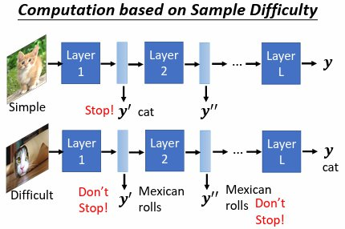

这种方法不一定限制在计算资源比较有限的情况。有时候就算计算资源比较很充足，但是对一些简单的图片，如果可以用比较少的层，得到需要的结果，其实也就够了，这样就可以省下一些计算资源去做其他的事情。  
