大部分的深度学习就是在不断的调整超参数，或者在决定网络架构，改变学习率等等。实际上没有什么好方法来调这些超参数，工业界一次使用多个 GPU，这些 GPU 跑多组不同的超参数，看看哪一组超参数可以得到最好的结果。

学术界通常没有那么多 GPU，通常需要凭着经验和直觉定义可能效果比较好的超参数，然后看看这些超参数会不会得到好的结果，但是这样的方法往往会花费很多时间，因为需要不断的去调整这些超参数。

元学习就是让机器自己去调整这些超参数，机器自己学习一个最优的模型和网络架构，然后得到好的结果，也就是机器去学习如何学习。

# 基本概念

将学习算法看作函数 $F$ ：将训练数据输入进 $F$，$F$ 输出一个模型 $f$ ，$F$ 通常是人为设定的，$f$ 是从数据中学习到的：

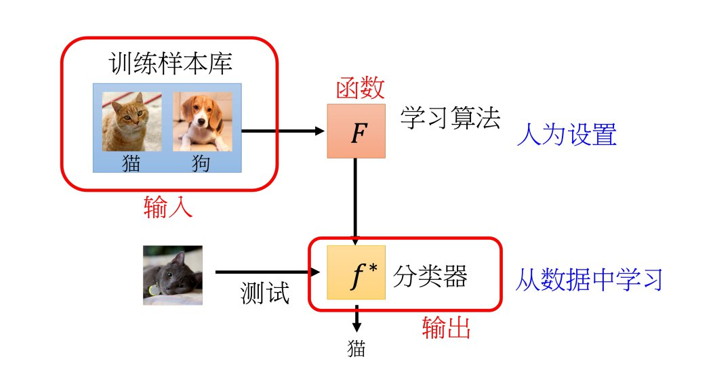

元学习就是要用机器学习的方法寻找一个学习算法 $F$ 。

## 元学习的三个步骤

### Step 1. 什么是可以学习的？

在元学习中，通常会考虑要让机器自己学习网络的架构、初始化的参数、学习率等，这些在学习算法里面想要它自学的东西统称为 $\boldsymbol{\phi}$ ，对应的学习算法是 $F_\boldsymbol{\phi}$ ：

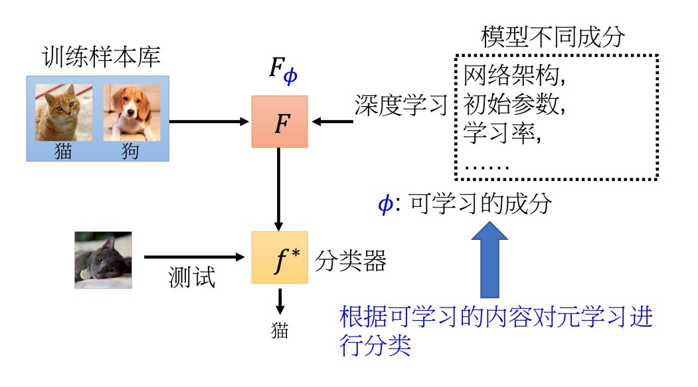

### Step 2. 定义损失函数

$\mathcal{L}(\boldsymbol{\phi})$ 代表学习算法 $F_\boldsymbol{\phi}$ 的性能。

在一般的机器学习中，需要搜集特定任务的资料，在元学习中，需要收集的是多种训练任务：

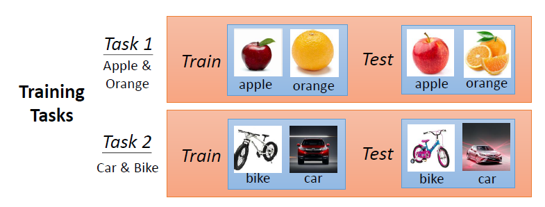

定义 $\mathcal{L}(\boldsymbol{\phi})$ 的步骤：

1. 将某一训练任务的训练数据输入进学习算法 $F_\boldsymbol{\phi}$，得到模型 $f_{\boldsymbol{\theta}_1}$ 。
2. 使用对应训练任务的测试数据对模型 $f_{\boldsymbol{\theta}_1}$ 进行测试，计算总损失 $\mathcal{L}_1$ ：
	- $\mathcal{L}_1$ 越小，表示模型 $f_{\boldsymbol{\theta}_1}$ 越好，代表学习算法 $F_\boldsymbol{\phi}$ 是好的。
	- $\mathcal{L}_1$ 越大，表示模型 $f_{\boldsymbol{\theta}_1}$ 越差，代表学习算法 $F_\boldsymbol{\phi}$ 是差的。

3. 以此类推，每一个训练任务都做这样的操作，得到每一个训练任务的测试数据的总损失 $\mathcal{L}_i$ 。
4. $\mathcal{L}(\boldsymbol{\phi}) = \displaystyle\sum_{i=1}^{N} \mathcal{L}_i$ 。

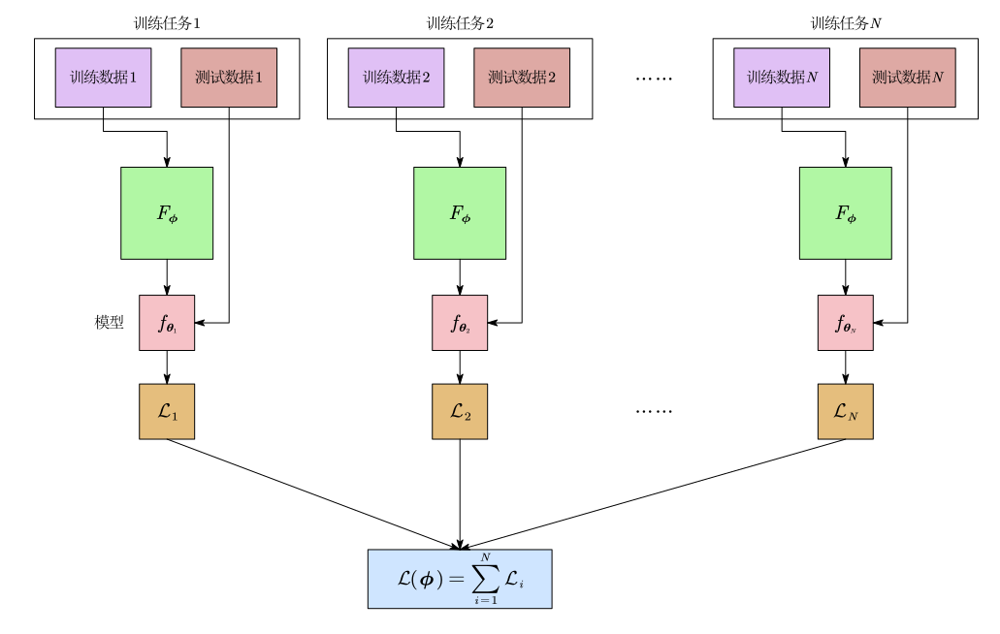

### Step 3. 优化

如果 $\displaystyle\frac{\partial\mathcal{L}(\boldsymbol{\phi})}{\partial\boldsymbol{\phi}}$ 存在，那就可以用梯度下降的方法实现。

如果 $\displaystyle\frac{\partial\mathcal{L}(\boldsymbol{\phi})}{\partial\boldsymbol{\phi}}$ 不存在(比如 $\boldsymbol{\phi}$ 是网络结构)，那可以用强化学习的方法来实现。

总之，可以让机器自己学习出最好的学习算法 $F_{\boldsymbol{\phi}^*}$ 。

## 对 $F_{\boldsymbol{\phi}^*}$ 进行测试

把测试任务里面的训练数据输入到学习算法 $F_{\boldsymbol{\phi}^*}$ 中输出一个模型 $f$，然后把测试任务的测试数据输入给模型 $f$ 得到最终结果：

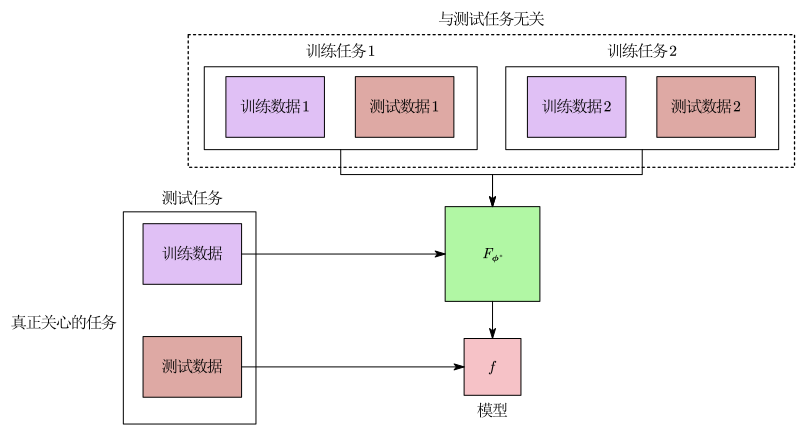

实际上真正关心的是测试任务里面的测试数据，因为这个测试数据是我们真正要分类的东西。

# 元学习与机器学习

## 两者的目标：

机器学习：找到一个能够完成特定任务的 $f$ 。

元学习：找到一个学习算法 $F$ ，这个算法能够输出完成特定任务的 $f$ 。

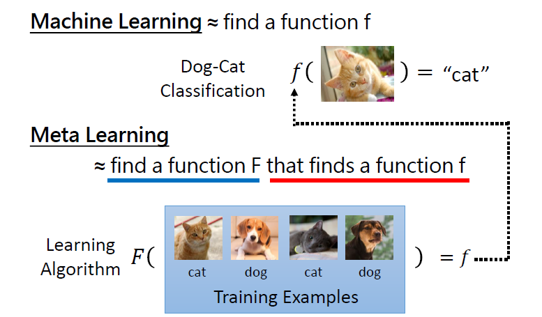

## 两者的训练数据：

机器学习：使用一个特定任务中的训练数据进行训练。

元学习：使用若干个训练任务进行训练，每个训练任务中都有训练数据及测试数据。

- 训练任务中的训练数据叫做 Support Set 。
- 训练任务中的测试数据叫做 Query Set 。

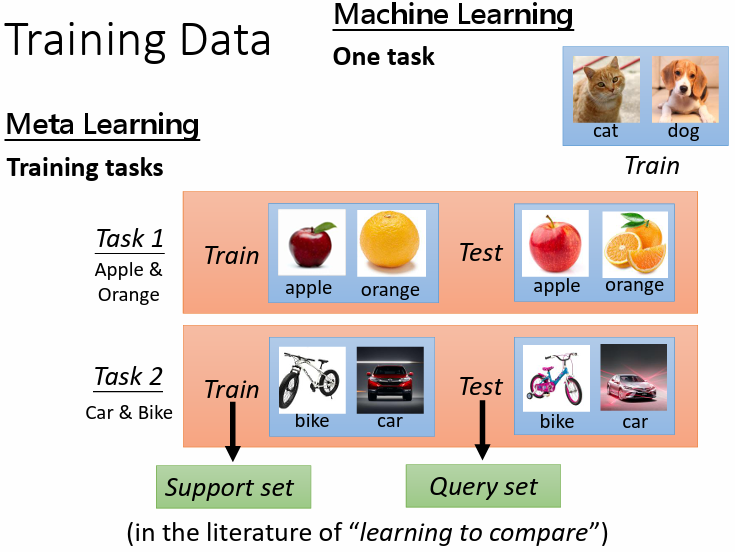

## 两者的训练过程：

机器学习：人为设定学习算法，称作 Within-task Training 。

元学习：多个任务上训练得到学习算法，称作 Across-task Training 。

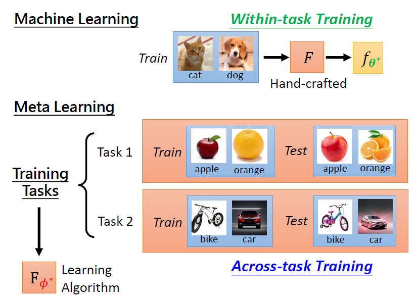

## 两者的测试过程：

机器学习：直接使用训练得到的模型在同一任务中对测试数据进行测试，称作 Within-task Testing 。

元学习：需要测试的是学习算法的好坏，所以在另一个测试任务中测试，称作 Across-task Testing 。

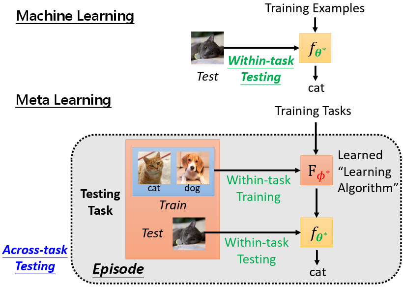

## 两者的损失函数

机器学习：一个任务中训练数据的损失。

元学习：多个训练任务的测试数据损失之和。

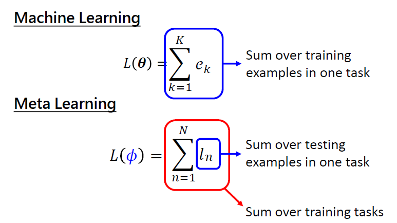

## 相同点

机器学习会在训练数据上发生过拟合的问题，元学习会在训练任务上发生过拟合的问题，比如：这个学习算法在训练任务上做得很好，面对一个新的测试的任务反而会做得不好。

机器学习会收集更多的训练数据来提升模型性能，元学习也可以通过收集更多的训练任务来提升学习算法的性能。

机器学习会做数据增强，比如图片的旋转、平移、缩放等，元学习同样也可以做数据增强，即想一些方法来增加训练任务，比如：把训练任务的标签做一些变化，或者把训练任务的数据做一些变化等。

两者都需要调整超参数。

在机器学习中不仅仅有训练样本和测试样本，同时还有验证集的样本，用在验证集样本中的表现来选择你的模型，元学习中也有用于验证的任务，即有训练任务、验证任务和测试任务。

# 学习算法中什么是可以被学习的

## 模型初始化参数 $\boldsymbol{\theta}_0$

### 模型无关元学习(MAML，model-agnostic meta-learning) & First order MAML

一般 $\boldsymbol{\theta}_0$ 是随机初始化的，对结果往往有一定程度的影响。可以通过一些训练的任务，来找出一个对训练特别有帮助的初始化参数。  

MAML 要做的事情就是学一个最好的初始化参数 $\boldsymbol{\theta}_0$ ，由于 $\boldsymbol{\theta}_0$ 是学习算法要学的东西，所以另外记为 $\boldsymbol{\phi}$ 。

模型从初始化参数 $\boldsymbol{\phi}$ 开始训练，把第 $i$ 个训练任务的训练数据输入进学习算法 $F_\boldsymbol{\phi}$，得到训练后模型 $f_{\boldsymbol{\theta}_i}$ ，模型的最终参数 $\boldsymbol{\theta}_i$ 与初始化参数 $\boldsymbol{\phi}$ 有关。

模型在第 $i$ 个训练任务的测试数据上的损失为 $\mathcal{L_i}(\boldsymbol{\theta}_i)$ ，那么学习算法的损失函数就是 $\mathcal{L}(\boldsymbol{\phi})=\displaystyle\sum_{i=1}^{N}\mathcal{L}_i(\boldsymbol{\theta}_i)$ 。

通过梯度下降来最最小化 $\mathcal{L}(\boldsymbol{\phi})$ ：$\boldsymbol{\phi}\leftarrow\boldsymbol{\phi}-\eta\nabla_\boldsymbol{\phi}\mathcal{L}(\boldsymbol{\phi})$ 。

在训练学习算法 $F_{\boldsymbol{\phi}}$ 的时候，MAML 只考虑一次模型 $f$ 的参数更新，但当训练好后得到一个较好的学习算法 $F_{\boldsymbol{\phi}^*}$ 且拿去实际应用时，往往会让模型 $f$ 多更新几次参数：

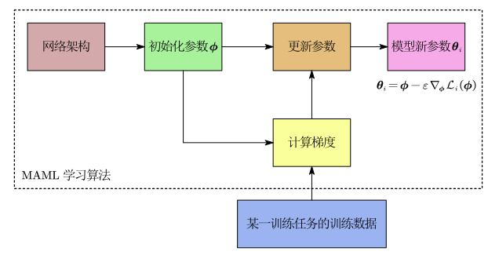

$$
\nabla_\boldsymbol{\phi}\mathcal{L}(\boldsymbol{\phi})=\nabla_\boldsymbol{\phi}\sum_{i=1}^{N}\mathcal{L}_i(\boldsymbol{\theta}_i)=\sum_{i=1}^{N}\nabla_\boldsymbol{\phi}\mathcal{L}_i(\boldsymbol{\theta}_i),\\\\
\nabla_\boldsymbol{\phi}\mathcal{L}_i(\boldsymbol{\theta}_i)=\frac{\partial\mathcal{L}_i(\boldsymbol{\theta}_i)}{\partial\boldsymbol{\phi}}=\frac{\partial\mathcal{L}_i(\boldsymbol{\theta}_i)}{\partial\boldsymbol{\theta}_i}\cdot\frac{\partial\boldsymbol{\theta}_i}{\partial\boldsymbol{\phi}},\\\\
\boldsymbol{\theta}_i=\boldsymbol{\phi}-\varepsilon\nabla_\boldsymbol{\phi}\mathcal{L}_i(\boldsymbol{\phi}),\\\\
\frac{\partial\boldsymbol{\theta}_i}{\partial\boldsymbol{\phi}} = I-\varepsilon\nabla^2_\boldsymbol{\phi}\mathcal{L}_i(\boldsymbol{\phi}).
$$

假设模型有 $n$ 个参数，那么：

$$
\nabla_\boldsymbol{\phi}\mathcal{L}_i(\boldsymbol{\theta}_i)=\begin{bmatrix}\frac{\partial\mathcal{L}_i(\boldsymbol{\theta}_i)}{\partial\theta_{i,1}},\frac{\partial\mathcal{L}_i(\boldsymbol{\theta}_i)}{\partial\theta_{i,2}},\cdots,\frac{\partial\mathcal{L}_i(\boldsymbol{\theta}_i)}{\partial\theta_{i,n}}\end{bmatrix} \cdot 
\begin{bmatrix}
1-\varepsilon\frac{\partial^2\mathcal{L}_i(\boldsymbol{\phi})}{\partial\phi_1\partial\phi_1} & -\varepsilon\frac{\partial^2\mathcal{L}_i(\boldsymbol{\phi})}{\partial\phi_1\partial\phi_2} & \cdots & -\varepsilon\frac{\partial^2\mathcal{L}_i(\boldsymbol{\phi})}{\partial\phi_1\partial\phi_n}\\
-\varepsilon\frac{\partial^2\mathcal{L}_i(\boldsymbol{\phi})}{\partial\phi_2\partial\phi_1} & 1-\varepsilon\frac{\partial^2\mathcal{L}_i(\boldsymbol{\phi})}{\partial\phi_2\partial\phi_2} & \cdots & -\varepsilon\frac{\partial^2\mathcal{L}_i(\boldsymbol{\phi})}{\partial\phi_2\partial\phi_n}\\
\vdots & \vdots & & \vdots \\
-\varepsilon\frac{\partial^2\mathcal{L}_i(\boldsymbol{\phi})}{\partial\phi_n\partial\phi_1} & -\varepsilon\frac{\partial^2\mathcal{L}_i(\boldsymbol{\phi})}{\partial\phi_n\partial\phi_2} & \cdots & 1-\varepsilon\frac{\partial^2\mathcal{L}_i(\boldsymbol{\phi})}{\partial\phi_n\partial\phi_n}\\
\end{bmatrix}.
$$
由于求二阶导很麻烦，并且 $\varepsilon$ 通常比较小，所以把 $\varepsilon\displaystyle\frac{\partial^2\mathcal{L}_i(\boldsymbol{\phi})}{\partial\phi_k\partial\phi_l}$ 忽略掉(First order MAML)，那么就有：

$$
\frac{\partial\boldsymbol{\theta}_i}{\partial\boldsymbol{\phi}} = I-\varepsilon\nabla^2_\boldsymbol{\phi}\mathcal{L}_i(\boldsymbol{\phi}) \approx I,\\\\
\nabla_\boldsymbol{\phi}\mathcal{L}_i(\boldsymbol{\theta}_i)=\frac{\partial\mathcal{L}_i(\boldsymbol{\theta}_i)}{\partial\boldsymbol{\phi}}=\frac{\partial\mathcal{L}_i(\boldsymbol{\theta}_i)}{\partial\boldsymbol{\theta}_i}\cdot\frac{\partial\boldsymbol{\theta}_i}{\partial\boldsymbol{\phi}}\approx \frac{\partial\mathcal{L}_i(\boldsymbol{\theta}_i)}{\partial\boldsymbol{\theta}_i}=\nabla_{\boldsymbol{\theta}_i}\mathcal{L}_i(\boldsymbol{\theta}_i),\\\\
\nabla_\boldsymbol{\phi}\mathcal{L}(\boldsymbol{\phi})=\nabla_\boldsymbol{\phi}\sum_{i=1}^{N}\mathcal{L}_i(\boldsymbol{\theta}_i)=\sum_{i=1}^{N}\nabla_\boldsymbol{\phi}\mathcal{L}_i(\boldsymbol{\theta}_i)\approx\sum_{i=1}^{N}\nabla_{\boldsymbol{\theta}_i}\mathcal{L}_i(\boldsymbol{\theta}_i).
$$
实际编程时，往往无法遍历 $N$ 个训练任务从而拿到 $N$ 个训练任务的 $\nabla_{\boldsymbol{\theta}_i}\mathcal{L}_i(\boldsymbol{\theta}_i)$ ，通常是在 $N$ 个训练任务中随机采样一个批次的任务，一般一个批次有 4—32 个训练任务，First order MAML 实际的算法流程为：

对每一次元迭代(Meta Iteration)：

​	随机采样一个批次的训练任务，对批次中的每个训练任务：

​		用训练任务的训练数据更新一次参数得到参数 $\boldsymbol{\theta}_i$ 。

​		在训练任务的测试数据上计算损失 $\mathcal{L}_i(\boldsymbol{\theta}_i)$ ，并得到对应的梯度方向 $\nabla_{\boldsymbol{\theta}_i}\mathcal{L}_i(\boldsymbol{\theta}_i)$ 。

​	计算这个批次内所有训练任务的梯度方向和 $\displaystyle\sum_{i=1}^{\text{BatchSize}}\nabla_{\boldsymbol{\theta}_i}\mathcal{L}_i(\boldsymbol{\theta}_i)$ 。

​	$\boldsymbol{\phi}\leftarrow\boldsymbol{\phi}-\eta\displaystyle\sum_{i=1}^{\text{BatchSize}}\nabla_{\boldsymbol{\theta}_i}\mathcal{L}_i(\boldsymbol{\theta}_i)$ 。

### Reptile

Reptile 是从 $N$ 个训练任务中随机挑选一个，然后更新多次模型 $f$ 的参数后得到模型的最终参数 $\boldsymbol{\theta}_i$ ，Reptile直接把最终参数和初始参数的差值作为更新方向，$\boldsymbol{\phi} \leftarrow \boldsymbol{\phi} + \eta (\boldsymbol{\theta}_i - \boldsymbol{\phi})$ ：

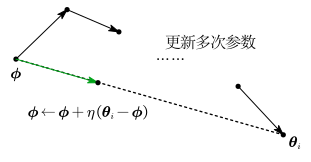

## 优化器

一般的优化器都是人为设计的，比如 Adam。

在更新参数的时候，需要决定学习率等超参数，可以通过学习算法学习出一个优化器，从而实现学习率这种超参数的自动更新。

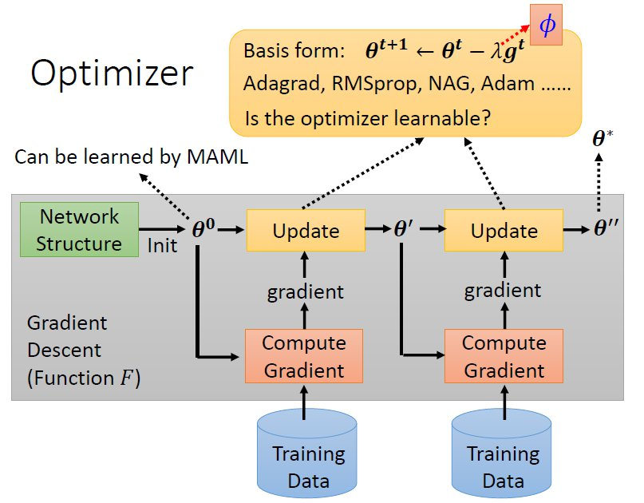

## 网络架构

用学习算法去学习网络架构，这部分的研究被称为神经网络架构搜索(Neural Architecture Search， NAS)。

### 强化学习的方法

现在学习算法里面想要它自学的东西 $\boldsymbol{\phi}$ 是网络的架构，那么根本就没法计算 $\nabla_\boldsymbol{\phi}\mathcal{L}(\boldsymbol{\phi})$ ，这种情况下可以收用强化学习的方法。具体做法是：

1. 把 $\boldsymbol{\phi}$ 想成是一个智能体的参数，这个智能体的输出是网络架构相关的超参数，比如网络宽度、深度等等。
2. 然后训练这个智能体，让它去最大化一个回报，即 $-\mathcal{L}(\boldsymbol{\phi})$，就等于最小化 $\mathcal{L}(\boldsymbol{\phi})$ 。

比如：有一个智能体是 RNN 架构，这个 RNN 架构每次会输出一个网络架构有关的超参数，根据这些超参数设计一个网络并训练这个网络，此时是单一任务训练，因为设计出的网络只针对一个任务。然后做强化学习，可以把这一个网络在测试数据上面的准确率当做回报来训练智能体，目标是最大化回报，这个过程其实就是跨任务训练，因为智能体要面对多个不同任务。

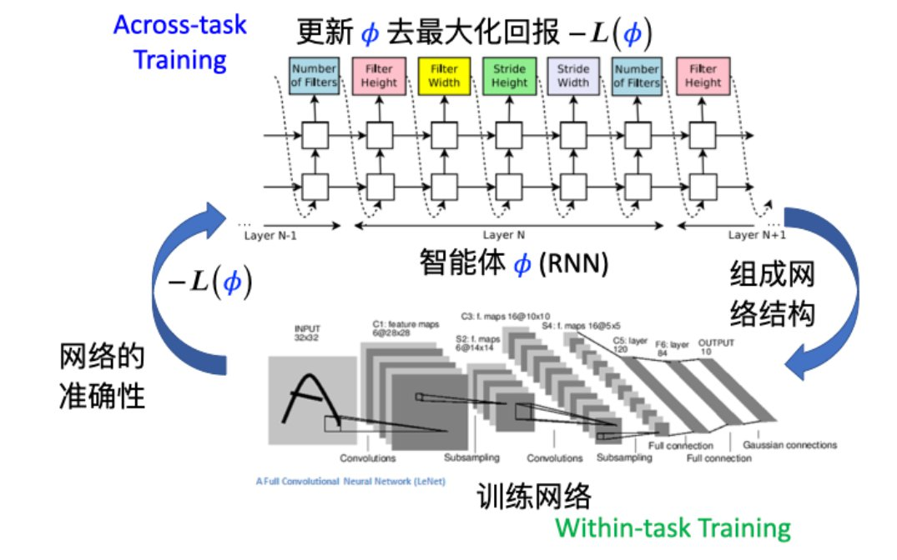

### 其他方法

Evolution Algorithm 和 Differentiable Architecture Search 。

## 数据增强的方式

在训练网络时，有时需要做数据增强，所以可以让学习算法学习出如何做数据增强比较好。

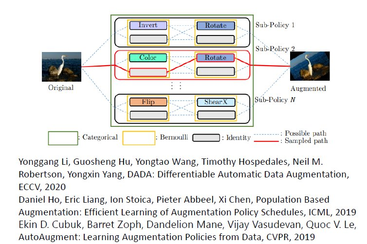

## 样本权重

训练网络时，可能需要为不同的样本配置不同的权重，所以可以将样本权重设置为学习算法要学习的参数 $\boldsymbol{\phi}$ 。

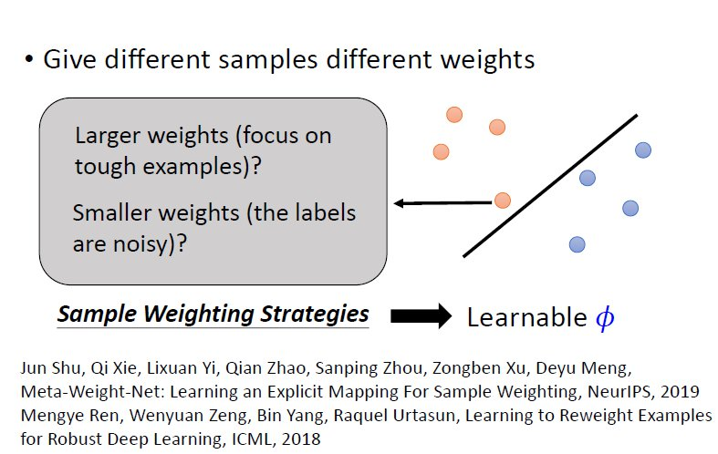

# 元学习的应用—少样本图像分类  

少样本图像分类就是每一个类别只有几张图片，希望通过很少的数据就可以训练出一个模型，给这个模型一张新的图片，它可以知道这张图片属于哪一个类别。

少样本图像分类有时会被叫做 $N$ 类别 $K$ 样本下的分类任务，意思是总共 $N$ 个类别，每一个类别有 $K$ 个样本。  

在元学习中，需要准备很多的 $N$ 类别 $K$ 样例下的分类任务当做训练任务。通常使用 Omniglot 数据集，Omniglot 是一个手写的数据集，它有 1623 个不同的字符类别，每一个字符类别有 20 个样本。

在使用 Omniglot 数据集的时候，通常把字符类别分成训练任务字符类和测试任务字符类。

如果要制造一个 $N$ 类别 $K$ 样本的训练任务，那么就是从训练任务字符类中随机挑选 $N$ 个字符类，然后每个字符类再去随机挑选 K 个样本，最后集合起来得到这个 $N$ 类别 $K$ 样本的训练任务。

如果要制造一个 $N$ 类别 $K$ 样本的训练任务，那就在测试任务字符类中去执行同样的操作。

这样我们就可以把 Omniglot 当做一个基准，然后在这个基准上面测试不同的元学习算法。